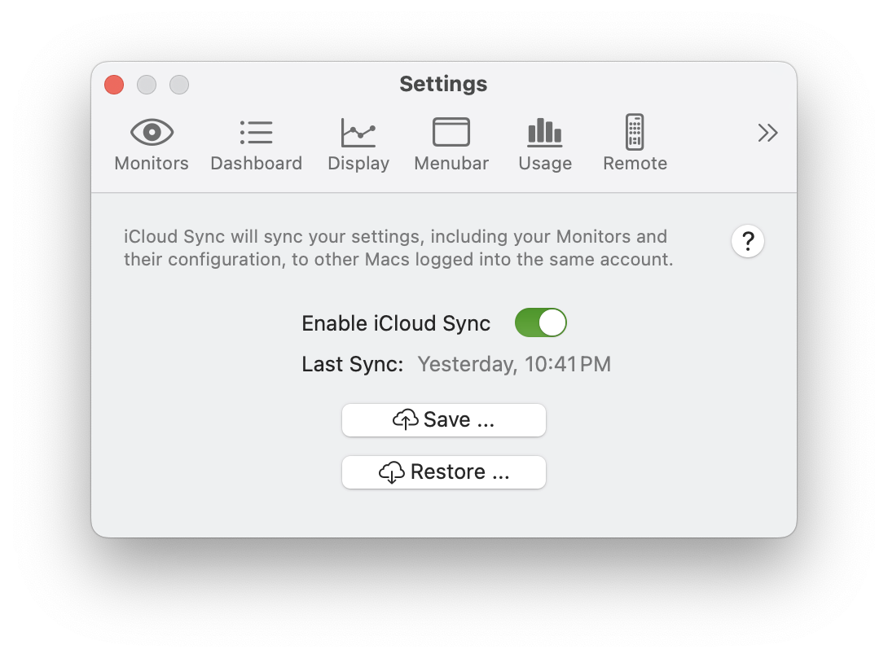
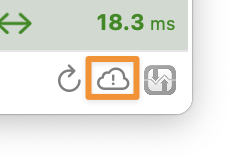
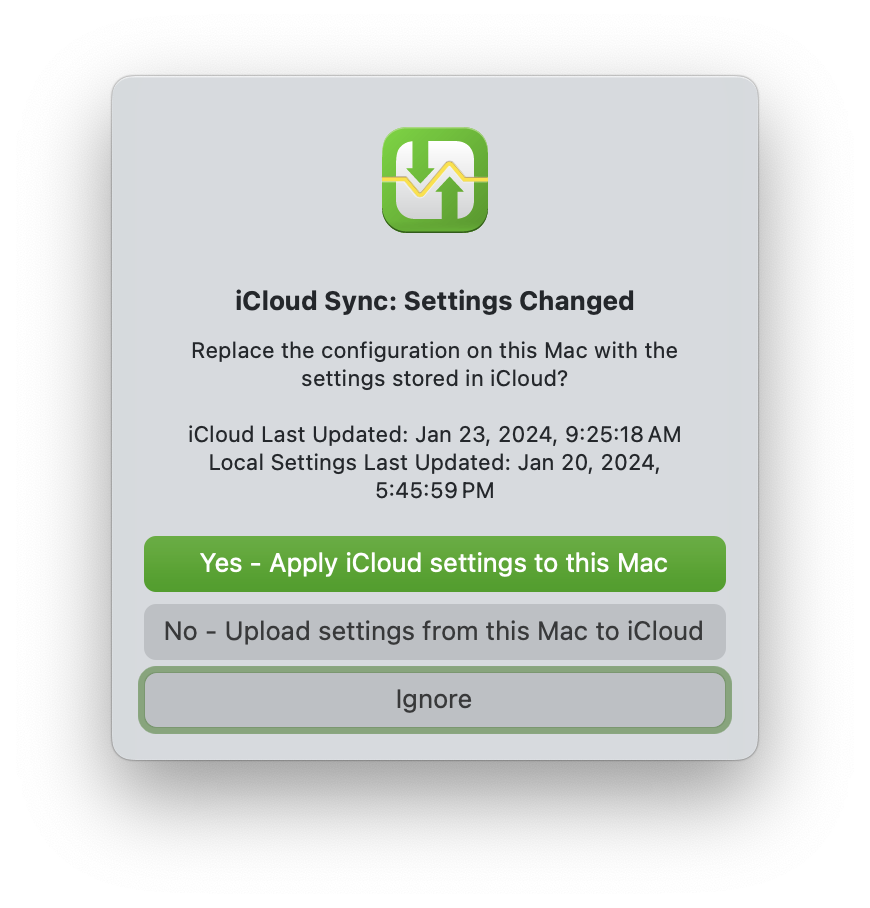

import NeedsReview from '@/components/NeedsReview.astro';

<NeedsReview />

iCloud Sync allows you to keep settings in sync across multiple Macs, and back up your settings in case of an issue. iCloud Sync will save all your configuration, including your Monitors and their configuration, in iCloud. As long as other Macs are logged into the same iCloud account, you can restore those settings on a different Mac with a single click.

|                        |                                                                                                                                                                                                                                                                              |
| ---------------------- | ---------------------------------------------------------------------------------------------------------------------------------------------------------------------------------------------------------------------------------------------------------------------------- |
| **Enable iCloud Sync** | If enabled, PeakHour will automatically keep your settings stored in iCloud. If a change to PeakHour is made on another Mac, you will be notified of the change. You can then choose whether to import those changes on the current Mac, or overwrite the changes in iCloud. |
| **Save**               | This will store the settings from your Mac to iCloud. Note this also happens automatically, any time a change to the settings are made.                                                                                                                                      |
| **Restore**            | This will overwrite your settings with those currently stored in iCloud.                                                                                                                                                                                                     |

## Handling Settings Changes

With iCloud Sync enabled, PeakHour will always save changes to iCloud automatically. If PeakHour is running on a different Mac, and also has iCloud Sync enabled, it will get notified of the change.

When new settings are detected, an icon will appear in the PeakHour control bar:

Click this icon to resolve the inconsistency.

