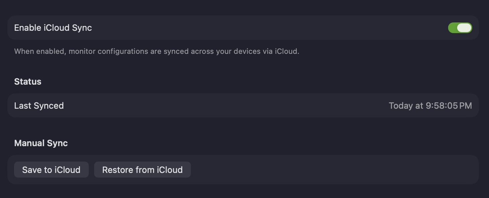
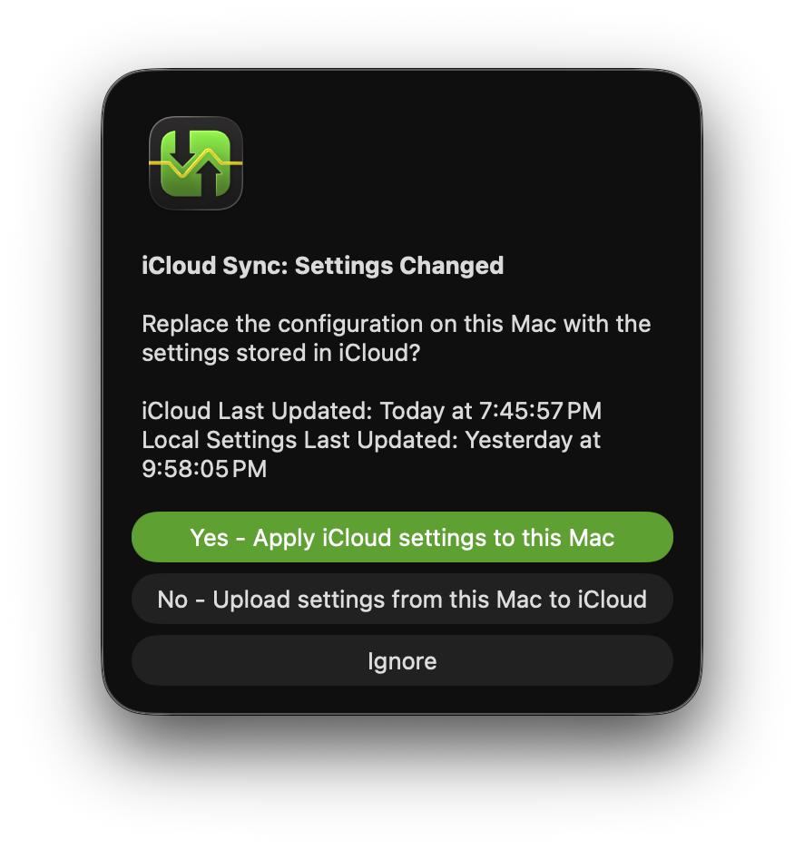

**iCloud Sync** keeps your settings in sync across your Macs and backs them up to iCloud. It saves all your configuration — including your monitors and their settings — so that any Mac signed in to the same iCloud account can restore them with a single click.

**Enable iCloud Sync** — when on, PeakHour automatically keeps your monitor configurations and settings stored in iCloud and synced across your devices. When a change is made on another Mac, you're notified and can choose whether to import it here or overwrite the version in iCloud.

## Status

**Last Synced** — when PeakHour last synced your settings with iCloud.

## Manual Sync

| Button | Description |
|--------|-------------|
| **Save to iCloud** | Stores your Mac's current settings to iCloud. This also happens automatically whenever you change a setting. |
| **Restore from iCloud** | Overwrites your Mac's settings with the version currently stored in iCloud. |

## Handling settings changes

With iCloud Sync enabled, PeakHour always saves changes to iCloud automatically. If another Mac that also has iCloud Sync enabled detects new settings, a cloud icon appears in the footer of the PeakHour window:

Click it to resolve the difference. PeakHour shows when each version was last updated and lets you choose how to proceed:

| Option | What it does |
|--------|--------------|
| **Yes – Apply iCloud settings to this Mac** | Replaces this Mac's configuration with the version stored in iCloud. |
| **No – Upload settings from this Mac to iCloud** | Keeps this Mac's settings and overwrites the version in iCloud. |
| **Ignore** | Dismisses the prompt for now and leaves both versions unchanged. |
