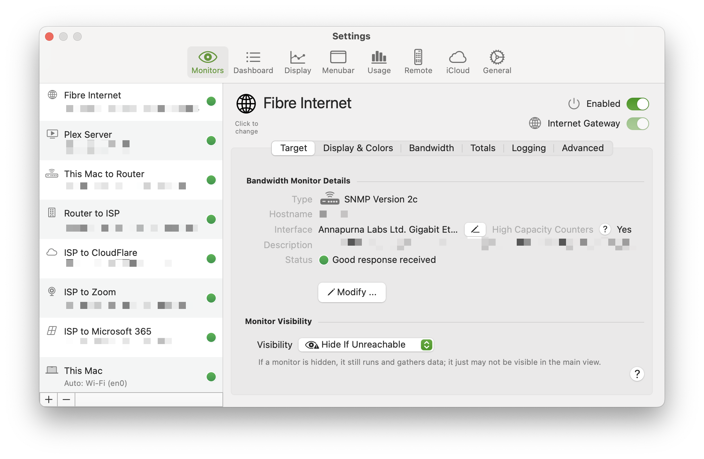

import NeedsReview from '@/components/NeedsReview.astro';

<NeedsReview />

To access Settings, click the  icon at the bottom of the main window, choose PeakHour \> Settings from the menu or press Command-,

#### [Monitors \[Settings\]](/user-guide/settings/monitors-settings/)

  - [Bandwidth Monitor](/user-guide/settings/monitors-settings/bandwidth-monitor/)
      - [Logging options](/user-guide/settings/monitors-settings/bandwidth-monitor/logging-options/)
      - [Display & Colors Options](/user-guide/settings/monitors-settings/bandwidth-monitor/display-colors-options/)
      - [Bandwidth options](/user-guide/settings/monitors-settings/bandwidth-monitor/bandwidth-options/)
      - [Totals options](/user-guide/settings/monitors-settings/bandwidth-monitor/totals-options/)
      - [Advanced options](/user-guide/settings/monitors-settings/bandwidth-monitor/advanced-options/)
  - [Connection Quality Monitor](/user-guide/settings/monitors-settings/connection-quality-monitor/)
      - [Display & Colors \[Connection Quality\]](/user-guide/settings/monitors-settings/connection-quality-monitor/display-colors-connection-quality/)
      - [Latency options](/user-guide/settings/monitors-settings/connection-quality-monitor/latency-options/)
      - [Logging options \[Connection Quality\]](/user-guide/settings/monitors-settings/connection-quality-monitor/logging-options-connection-quality/)

#### [Dashboard](/user-guide/settings/dashboard/)

#### [Display](/user-guide/settings/display/)

#### [Menu Bar](/user-guide/settings/menu-bar/)

#### [Usage](/user-guide/settings/usage/)

#### [Remote](/user-guide/settings/remote/)

#### [iCloud](/user-guide/settings/icloud/)

#### [General](/user-guide/settings/general/)

