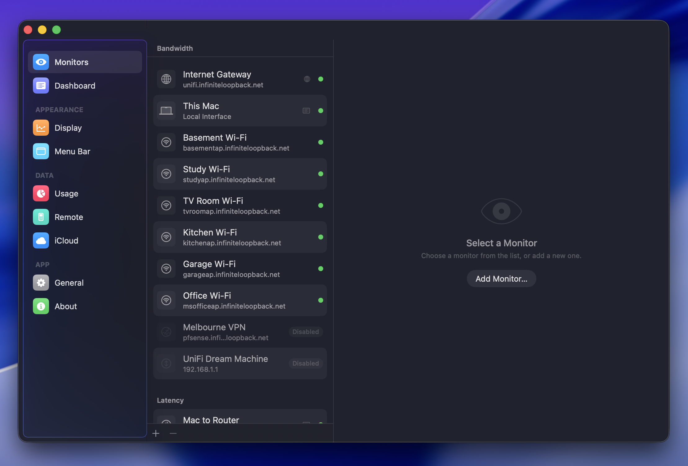

To open Settings, click the  button at the bottom of the main window, choose **PeakHour → Settings** from the menu, or press **⌘,** (Command-comma).

The Settings window is organised into sections, listed down the left:

#### [Monitors \[Settings\]](/user-guide/settings/monitors-settings/)

  - [Bandwidth Monitor](/user-guide/settings/monitors-settings/bandwidth-monitor/)
  - [Latency Monitor](/user-guide/settings/monitors-settings/latency-monitor/)

#### [Dashboard](/user-guide/settings/dashboard/)

#### [Display](/user-guide/settings/display/)

#### [Menu Bar](/user-guide/settings/menu-bar/)

#### [Usage](/user-guide/settings/usage/)

#### [Remote](/user-guide/settings/remote/)

#### [iCloud](/user-guide/settings/icloud/)

#### [General](/user-guide/settings/general/)

