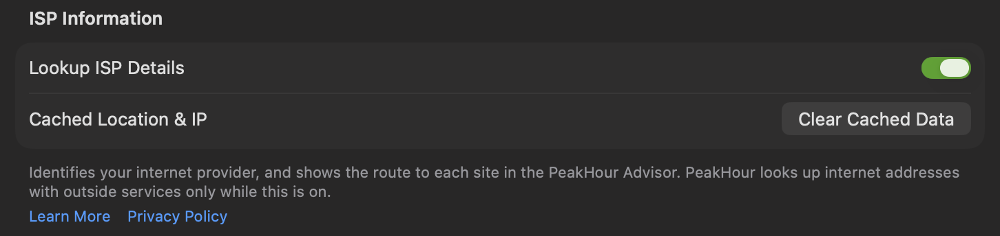

**ISP Information** identifies your internet provider, and lets the [PeakHour Advisor](/user-guide/advisor/) show the route to each site and where each site answers from. To do that, PeakHour has to look up internet addresses with outside services. This page lists every one of them, and what each receives.

The setting is **off** by default. Turn it on in **Settings → Dashboard → ISP Information → Lookup ISP Details**, or during first-time setup. Nothing is sent until you turn it on.

## What it shows

- **On the dashboard:** your provider's name and logo on the **ISP** segment, and its details in the ISP popover.
- **In the Advisor:** on [The Internet](/user-guide/advisor/the-internet/) page, the map of where each site answers from, and the route to each site with the name and logo of each network.

## What goes where

| Service | What it receives | What for |
|---------|------------------|----------|
| **ipify** (`api.ipify.org`) | A request from your Mac, which shows it your public IP address. | Finds your public IP address when your router doesn't report it, and while a VPN is on. |
| **MaxMind**, through PeakHour's own lookup service (`geoip.peakhour.app`) | Your public IP address, your ISP's gateway, the sites you monitor, and each router on the route to them. | The network name and approximate location of each address, for the ISP details, the map and the routes. |
| **RIPE NCC** (`stat.ripe.net`) | The address of a router that MaxMind can't name. | The network that the address belongs to. |
| **PeeringDB** (`peeringdb.com`) | A network number (ASN). | The network's web domain, to find its logo. |
| **Brandfetch** (`cdn.brandfetch.io`) | Web domains: your provider's, your router maker's, the networks on the routes, and the sites you monitor. | Logos. |

While the Advisor shows [The Internet](/user-guide/advisor/the-internet/) page, PeakHour also:

- traces the route to each site from your Mac, and asks your Mac's own DNS resolver for the names of the routers on it;
- sends a request to some well-known sites (for example on Cloudflare, Google or Apple) and asks some public DNS services which data centre answers, to place those sites on the map.

When you type a city under **Where is this monitor?** for one of your own monitors, Apple Maps receives the text to find the place.

## What stays on your Mac

- **Your Mac's location.** With Location Services allowed, the Advisor puts this Mac on the map, while the setting is on and the window is open. The location is never sent anywhere.
- **The places you set** for your own monitors.
- **The lookups** PeakHour has made, cached so it doesn't repeat them:

| What | Kept for |
|------|----------|
| Your public IP address | About 5 minutes, then checked again |
| Your provider's details | Until they change, or until you clear them |
| Address lookups (network and location) | 7 days, up to 200 addresses |
| Logos | Until you clear them |

## Clear Cached Data

**Clear Cached Data**, beside **Cached Location & IP** in the settings, removes:

- your public IP address and your provider's details and location;
- the cached address lookups;
- the logos;
- your router's make, model and location details.

It doesn't turn the setting off. While the setting stays on, PeakHour looks everything up again within a minute. It doesn't remove the places you set for your own monitors.

## When it's off

- The **ISP** segment of the dashboard shows a grey question mark instead of your provider.
- On The Internet page of the Advisor, the map and the routes are replaced by a note that asks you to turn ISP Information on.
- Turning the setting off doesn't delete what is already cached. Use **Clear Cached Data** first.

## With a VPN

When a VPN carries all of your traffic, the internet sees the VPN server's address, not yours. PeakHour then shows the VPN provider on the dashboard, marked **VPN**, and keeps your home provider's details saved for when the VPN goes off. The Advisor labels the VPN server on the map.
