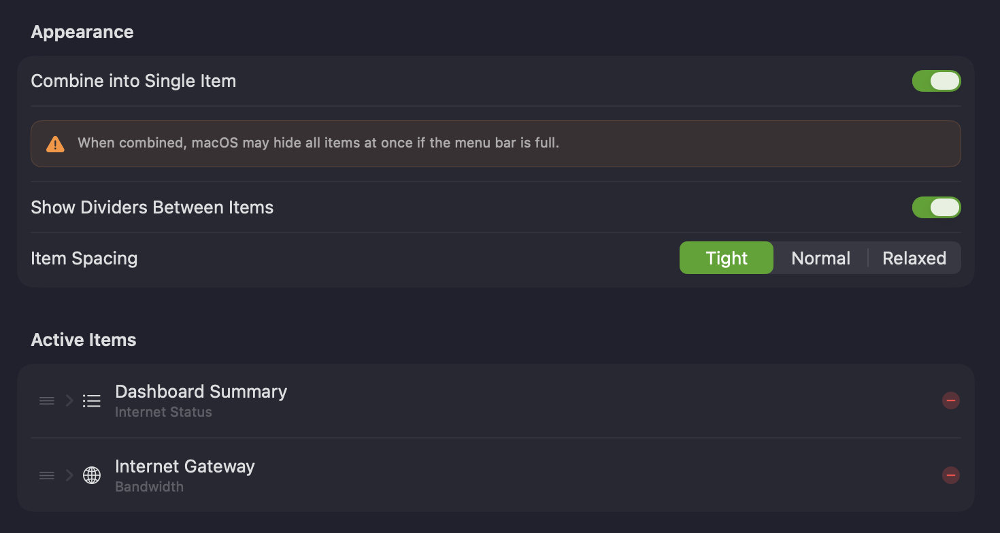
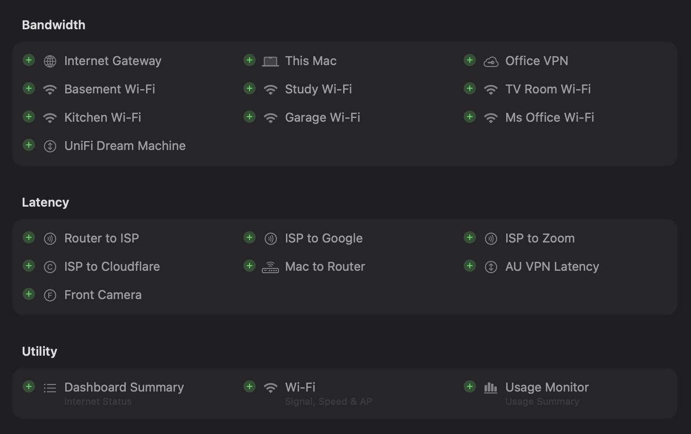
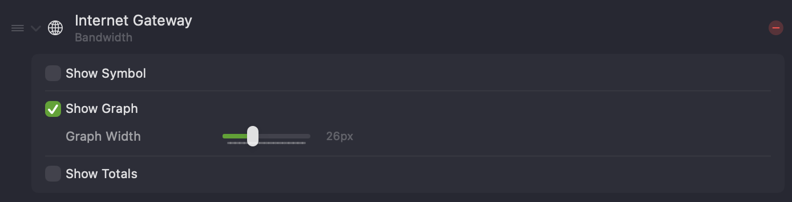
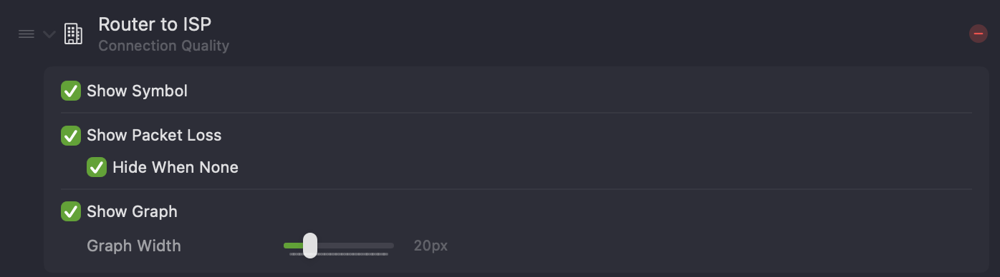
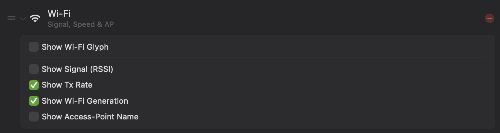
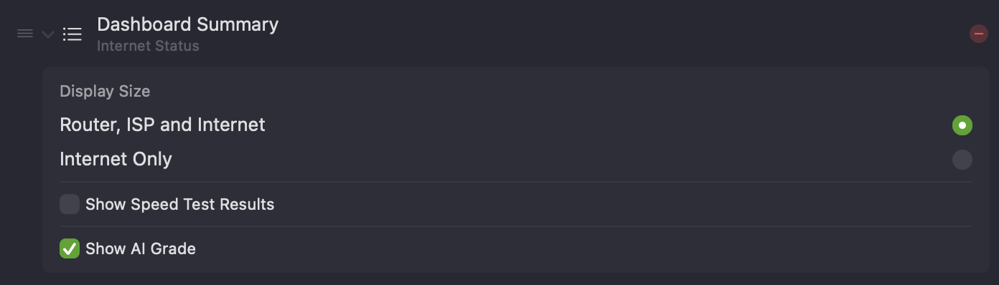
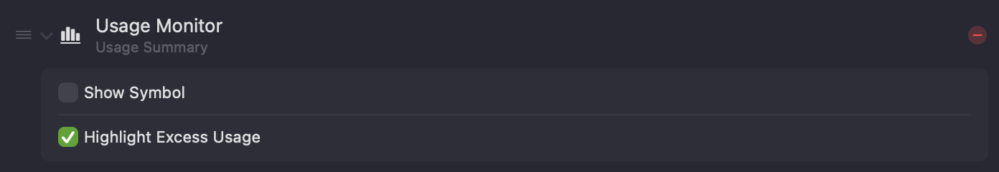

The **Menu Bar** settings let you choose which monitors, Wi-Fi stats, and summaries appear in the macOS menu bar and configure how each one looks.

## Appearance

Controls how PeakHour's menu bar items are presented as a group.

| Setting | Description |
|---------|-------------|
| **Combine into Single Item** | Groups all of PeakHour's menu bar items into one combined item. When combined, macOS may hide all of them at once if the menu bar runs out of room. |
| **Show Dividers Between Items** | Draws a divider between adjacent items. |
| **Item Spacing** | The gap between items — **Tight**, **Normal**, or **Relaxed**. |

## Active Items

The **Active Items** list shows what's currently in your menu bar.

- **Reorder** an item by dragging the handle on its left.
- **Remove** an item by clicking the red **−**.
- **Configure** an item by clicking its disclosure chevron to expand its options.

Below it, the **Available Items** list shows everything that isn't in the menu bar yet, grouped into **Bandwidth**, **Latency**, and **Utility** sections and laid out in a responsive multi-column grid that adapts to the width of the window. Click the  button on the left of an item to add it to the menu bar.

These three sections mirror the item types described below: Bandwidth and Latency hold your monitors, while Utility covers the Wi-Fi, Dashboard Summary, and Usage Monitor items. When everything is already in the menu bar, the list shows a friendly empty state with the PeakHour glyph in place of the grid.

Active items can be configured by type. Different item types have different options, described below.

### Bandwidth Menu Bar Item

Shows a Bandwidth Monitor's upload and download throughput in the menu bar.

The numbers are arranged:

- **Top left:** current upload speed
- **Bottom left:** current download speed
- **Top right:** total uploaded (when **Show Totals** is on)
- **Bottom right:** total downloaded (when **Show Totals** is on)

| Setting | Description |
|---------|-------------|
| **Show Symbol** | Shows the monitor's symbol, which helps tell similar monitors apart at the cost of a little menu bar space. |
| **Show Graph** | Shows a small graph beside the numbers. |
| **Graph Width** | The width of that graph. |
| **Show Totals** | Also shows the monitor's totals. See [Totals](/user-guide/settings/monitors-settings/bandwidth-monitor/#totals). |

### Latency Menu Bar Item

Shows a Latency Monitor's latency, and optionally packet loss, in the menu bar.

The numbers are:

- **Top:** current latency, in milliseconds.
- **Bottom:** packet loss (%) over the past 5 minutes.

| Setting | Description |
|---------|-------------|
| **Show Symbol** | Shows the monitor's symbol. |
| **Show Packet Loss** | Shows packet loss (%) below the latency value. |
| **Hide When None** | Only shows packet loss when some has occurred in the past 5 minutes; otherwise just the latency is shown. |
| **Show Graph** | Shows a small graph beside the latency value. |
| **Graph Width** | The width of that graph. |

### Wi-Fi Menu Bar Item

Shows live Wi-Fi stats for **This Mac**, so you can keep an eye on your wireless connection without opening the main window.

Choose which stats appear from the item's settings popover. They're arranged across up to two compact stacked rows to keep the item narrow. When your Mac isn't on Wi-Fi, the stats dash out (**–**).

| Setting | Description |
|---------|-------------|
| **Show Wi-Fi Glyph** | Shows the Wi-Fi symbol in the item. |
| **Show Signal (RSSI)** | Shows the current signal strength (RSSI) of the Wi-Fi connection, in dBm. |
| **Show Tx Rate** | Shows the current transmit rate — the negotiated link speed to the access point. |
| **Show Wi-Fi Generation** | Shows the Wi-Fi generation in use, such as Wi-Fi 6 or Wi-Fi 6E. |
| **Show Access-Point Name** | Shows the resolved name of the access point your Mac is connected to. See [Access Point names](/user-guide/main-view/internet-dashboard/#access-point-names). |

### Dashboard Summary (Internet Status)

A special item that summarises your internet status from the [Internet Dashboard](/user-guide/main-view/internet-dashboard/) — a row of hop icons running from your Mac (left) to the internet (right), each coloured by status. It's only available when the Internet Dashboard is enabled.

Each hop icon is coloured by its current status — green for OK, yellow for congestion, with a packet-loss indicator when loss has occurred in the past 5 minutes.

| Setting | Description |
|---------|-------------|
| **Display Size** | **Router, ISP and Internet** shows every hop; **Internet Only** shows just the final hop for a more compact item. |
| **Show Speed Test Results** | Includes the latest [Network Quality](/user-guide/settings/dashboard/#network-quality) (speed test) results. |
| **Show AI Grade** | Includes the [AI Advisor](/user-guide/main-view/internet-dashboard/#ai-advisor) letter grade. |

### Usage Monitor

A special item that shows your current internet usage, as measured by the Usage Monitor. See [Usage Monitoring](/troubleshooting/reference/usage-monitoring/).

| Setting | Description |
|---------|-------------|
| **Show Symbol** | Shows the Usage Monitor symbol in the item. |
| **Highlight Excess Usage** | Shows usage in red when your usage per day exceeds what's left for the period. |
