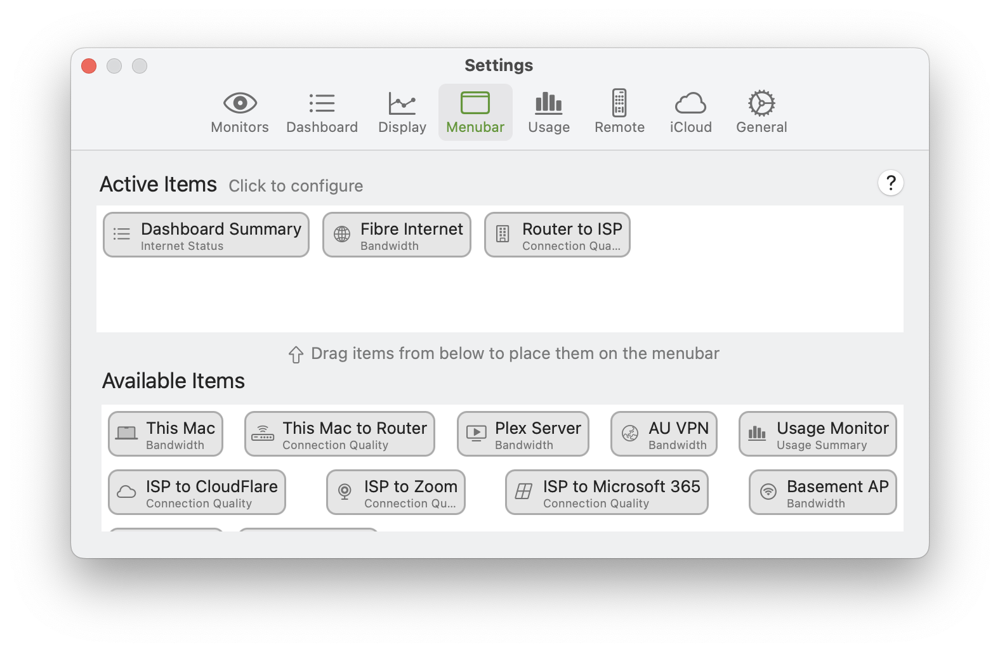
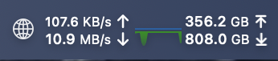
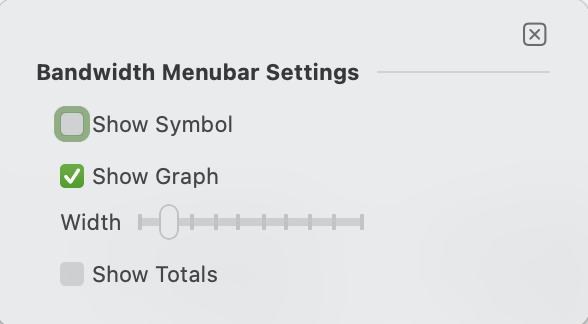
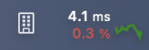
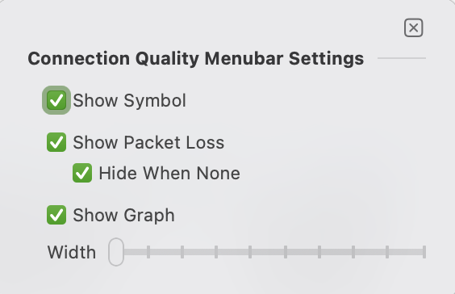
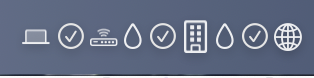
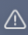
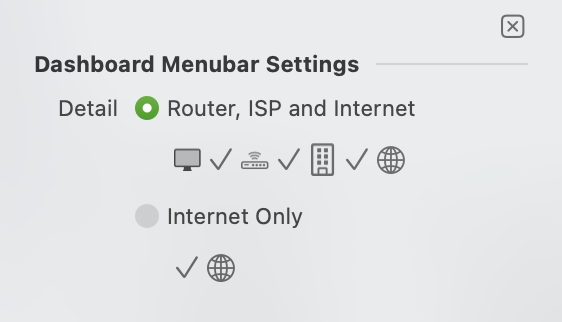
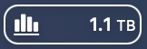
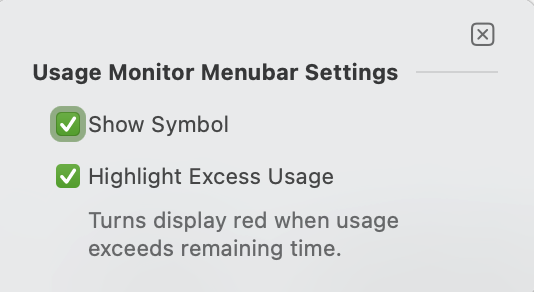

import NeedsReview from '@/components/NeedsReview.astro';

<NeedsReview />

- [Configuring Monitors](#MenuBar-ConfiguringMonitors)
      - [Bandwidth Menu Bar Item](#MenuBar-BandwidthMenuBarItem)
      - [Connection Quality Menu Bar Item](#MenuBar-ConnectionQualityMenuBarItem)
      - [Dashboard Summary (Internet Status)](#MenuBar-DashboardSummary\(InternetStatus\))
      - [Usage Monitor](#MenuBar-UsageMonitor)

Menu Bar settings allow you to add monitors to the menu bar, and configure their appearance.

## Configuring Monitors

Menu Bar settings are broken into two sections. The bottom section shows available items that can be added to the menu bar.

  - To add a monitor to the menu bar, drag it from the **Available Items** section to the **Active Items** section.

  - You can rearrange the menu bar by clicking and dragging to reorder them.

  - To remove a monitor from the menu bar, drag it from **Active Items** back to **Available Items**.

Most menu bar items can also be configured and customized. To configure a menu bar item, click to open its settings. Different monitor types have different settings.

### Bandwidth Menu Bar Item

A Bandwidth Menu Bar item shows the throughput (upload and download speed) of the monitor in the menu bar. You can customize the default monitor to also include additional information. When finished, click the 'x' or anywhere outside the settings popover to close and update the settings.

From left to right, the numbers displayed are:

  - **Top left:** Current upload speed

  - **Bottom left:** Current download speed

  - **Top right:** Total uploaded data

  - **Bottom right:** Total downloaded data

| **Setting**     | **Description**                                                                                                                                                                          |
| --------------- | ---------------------------------------------------------------------------------------------------------------------------------------------------------------------------------------- |
| **Show Symbol** | If enabled, the monitor’s symbol will be displayed in the menu bar. This can help to distinguish similarly-looking monitors from each other, but obviously takes up more menu bar space. |
| **Show Graph**  | This enables or disables a small graph to be displayed to the right of the numerical throughput numbers.                                                                                 |
| **Width**       | This controls the width of the graph.                                                                                                                                                    |
| **Show Totals** | If enabled, the Totals for this monitor will be displayed as well. For more information, see [Totals options](/user-guide/settings/monitors-settings/bandwidth-monitor/totals-options/). |

### Connection Quality Menu Bar Item

A Connection Quality Menu Bar item shows the latency of the host being monitored, in the menu bar. You can customize the default monitor to also include additional information. When finished, click the 'x' or anywhere outside the settings popover to close and update the settings.

The numbers displayed are:

  - **Top:** Current latency in milliseconds (ms).

  - **Bottom:** Percent packets lost (packet loss) in the past 5 minutes.

| **Setting**          | **Description**                                                                                                                                                                          |
| -------------------- | ---------------------------------------------------------------------------------------------------------------------------------------------------------------------------------------- |
| **Show Symbol**      | If enabled, the monitor’s symbol will be displayed in the menu bar. This can help to distinguish similarly-looking monitors from each other, but obviously takes up more menu bar space. |
| **Show Packet Loss** | If enabled, the monitor will show packet loss (%) below the latency value.                                                                                                               |
| **Hide When None**   | If enabled, packet loss will only be shown if some has been detected in the past 5 minutes. If no packet loss is detected, only the latency will be displayed.                           |
| **Show Graph**       | This enables or disables a small graph to be displayed to the right of the numerical latency number.                                                                                     |
| **Width**            | This controls the width of the graph.                                                                                                                                                    |

### Dashboard Summary (Internet Status)

This is a special Menu Bar item that shows a summary of your Internet status from the Internet Dashboard. Note this is only available if the Internet Dashboard is enabled.

This menu bar item shows a summary of the status of your Internet. The icons move from left (your Mac) to right (the Internet), with a status for each hop in between.

| **Symbol**                                                                                                                        | **Meaning**                                                           |
| --------------------------------------------------------------------------------------------------------------------------------- | --------------------------------------------------------------------- |
|  | The latency for this hop is currently OK / normal.                    |
|  | This hop is experiencing some latency.                                |
|  | Some packet loss has been observed on this hop in the past 5 minutes. |

<table>
<thead>
<tr class="header">
<th><strong>Setting</strong></th>
<th><strong>Description</strong></th>
</tr>
</thead>
<tbody>
<tr class="odd">
<td><strong>Detail</strong></td>
<td>
<strong>Router, ISP and Internet:</strong> Shows all hops from your Mac to the Internet.

<strong>Internet Only:</strong> Only shows the Internet hop. Use this for a more compact view.
</td>
</tr>
</tbody>
</table>

### Usage Monitor

This is a special Menu Bar item that shows your current Internet Usage, as measured by the Usage Monitor. For more information, see [Usage Monitoring](https://peakhoursupport.atlassian.net/wiki/spaces/P5W/pages/9503476/Usage+Monitoring).

| **Setting**                | **Description**                                                                       |
| -------------------------- | ------------------------------------------------------------------------------------- |
| **Show Symbol**            | Whether to display the Usage Monitor symbol in the menu bar item.                     |
| **Highlight Excess USage** | If enabled, usage will be displayed in red when usage/day exceeds the remaining time. |

