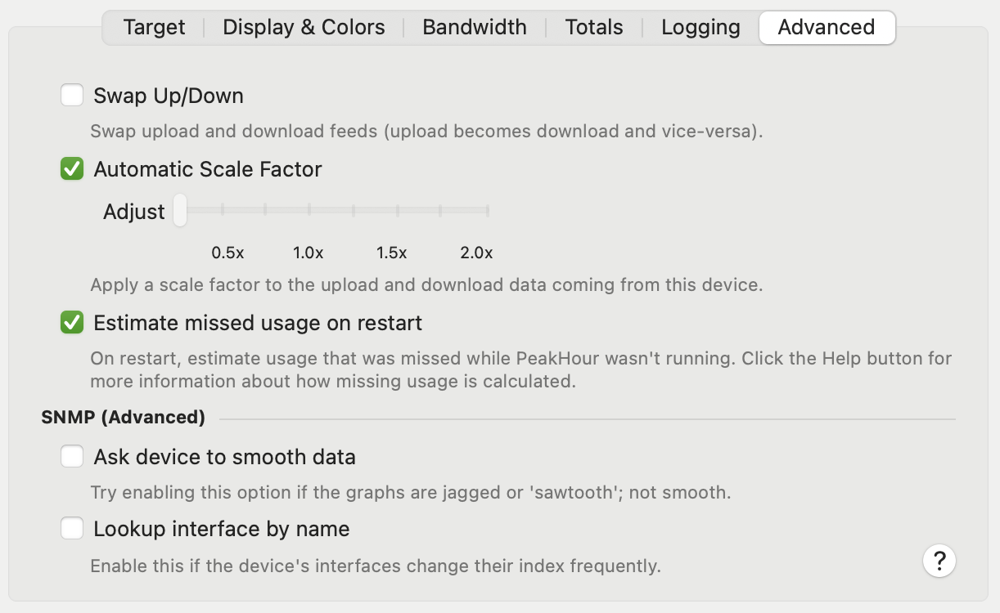

import NeedsReview from '@/components/NeedsReview.astro';

<NeedsReview />

<table>
<thead>
<tr class="header">
<th><strong>Setting</strong></th>
<th><strong>Description</strong></th>
</tr>
</thead>
<tbody>
<tr class="odd">
<td><strong>Swap Up/Down</strong></td>
<td>Swaps the inbound and outbound values around. Downloads become uploads and uploads become downloads. Useful for some devices that report traffic the wrong way around.</td>
</tr>
<tr class="even">
<td><strong>Automatic Scale Factor</strong></td>
<td>When enabled, traffic will be scaled at 1x, except for certain interfaces on Apple Airport devices that are known to report incorrect data.</td>
</tr>
<tr class="odd">
<td><strong>Adjust</strong></td>
<td>If <strong>Automatic Scale Factor</strong> is turned off, use this slider to manually set a scale factor for this target. Upload and download throughput will be scaled according to this value. This will effect all aspects of PeakHour's monitoring including throughput, graphic, bandwidth, traffic totals and (if enabled) usage.</td>
</tr>
<tr class="even">
<td><strong>Estimate missed usage on restart</strong></td>
<td>
When PeakHour is restarted for any reason, it will check its targets for any usage that was missed during the period it wasn't running.

Disabling this option turns off this usage estimation feature.

For more information on usage estimation, see the <a href="https://peakhoursupport.atlassian.net/wiki/spaces/WIKI3/pages/458775/Usage+Monitoring">Usage Monitoring</a> wiki.
</td>
</tr>
<tr class="odd">
<td><strong>Ask device to smooth data (SNMP only)</strong></td>
<td>
When this option is enabled, PeakHour will send an snmpset command to the device at startup telling it to set the counter refresh interval to 1 second. Some SNMP devices (in particular, Mac OS X and Linux snmpd) have a default of 5 seconds. This results in jagged or 'sawtooth' graphs that have a low fidelity.

Enabling this option will tend to make graphs smoother, if the device supports it.
</td>
</tr>
<tr class="even">
<td><strong>Lookup interface by name</strong></td>
<td>
SNMP typically uses a number (or index) to identify interfaces on your devices. On some devices however, this index can change - for example, when the device is rebooted. This can cause PeakHour to lose track of the interface periodically.

Turning this option on will cause PeakHour to look up the interface by name, instead of by numerical index. PeakHour should no longer lose track of the interface, but this may cause incompatibility with some devices.
</td>
</tr>
</tbody>
</table>

