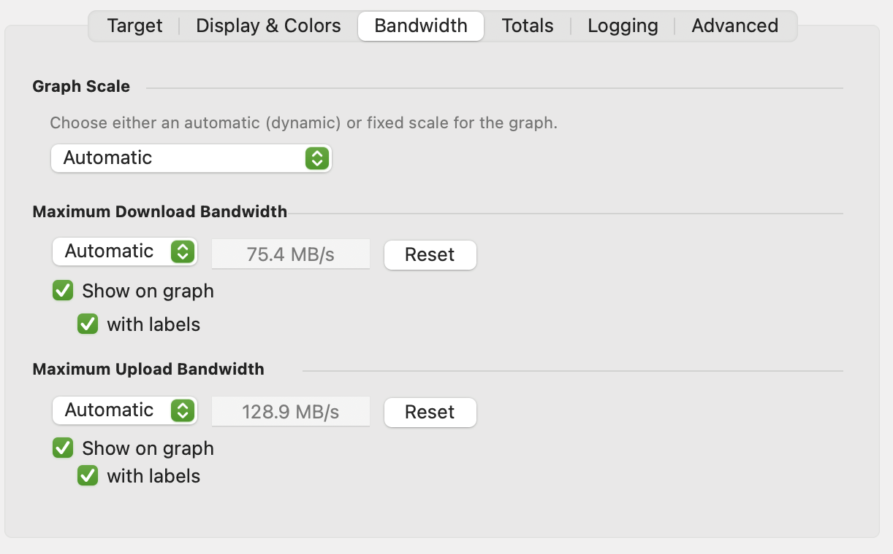

The bandwidth tab allows you to specify the scale of the graph and the maximum inbound and outbound bandwidth the target is capable of.

## Graph Scale

There are 3 options for the graph scale:

  - **Automatic**  
    ** **The graph will automatically scale to fit whatever graph is currently on the screen.

  - **Available Bandwidth**  
    Scale to whatever maximum inbound / outbound bandwidth (whichever is greatest)

  - **Fixed**  
    Set a specific fixed scale.

## Maximum Inbound / Outbound Bandwidth

The maximum bandwidth is used for a number of calculations:

  - If the **Show on graph** option is enabled, a line will be drawn showing the maximum bandwidth.

  - If **Graph Scale** is set to **Available Bandwidth**, the maximum bandwidth is used to calculate the scale of the graph.

**(Dropdown)**

- **Automatic**  
  This setting automatically calculates the maximum bandwidth by observing throughout.  
  You can reset this to the current graph value by clicking **Reset**.
- **Custom...**  
  Choosing this option will reveal a option to manually enter a maximum value in kbits/sec, Mbits/sec, KBytes/sec or MBytes/sec.
- **Static**  
  Choose one of the pre-configured values from the list.

**Reset (Automatic only)**

If the drop down is set to **Automatic**, this resets the detected bandwidth to whatever the current maximum is displayed on the graph.

**Show on graph**

When enabled, a line is drawn on the graph at the maximum bandwidth level.

**With labels**

A numeric label with the maximum is drawn on the line as well.

