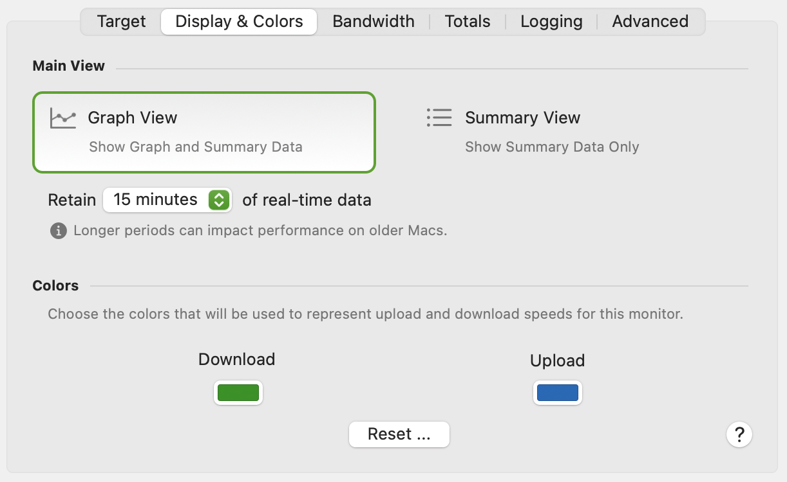
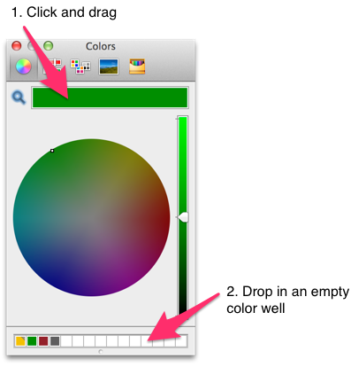

import img1 from './display-colors-options-images/cleanshot-2024-05-25-at-10-58-20-2x-20240525-145825.png';
import img2 from './display-colors-options-images/cleanshot-2024-05-25-at-10-59-47-2x-20240525-145955.png';

The **Display & Colors** tab contains options for customizing how the device is displayed.

## Main View

<table>
<tbody>
<tr class="odd">
<td><strong>Graph View</strong></td>
<td>
Sets the view of the target in the main window to include a graph as well as details. You can also toggle the graph on and off by clicking the disclosure triangle.

</td>
</tr>
<tr class="even">
<td><strong>Summary View</strong></td>
<td>
Summary View just shows the inbound (download) and outbound (upload) speed.

If Display &gt; Fuel Gauges is enabled, a gauge will be displayed behind the numbers showing the current upload or download speed relative to the maximum bandwidth. See <a href="/user-guide/settings/display/">Display</a> for more details.

Clicking the upload / download numbers toggles between the upload / download speed and total uploaded and downloaded traffic. See <a href="/user-guide/settings/monitors-settings/bandwidth-monitor/totals-options/">Totals options</a> for more details.

</td>
</tr>
<tr class="odd">
<td><strong>Keep</strong></td>
<td>
Sets how many minutes of data the main graph will retain. The main graph can be scrolled vertically with either the mouse or trackpad, allowing you to see data up to 12 hours in the past. Note that larger values here can impact performance.

You can use the <a href="/user-guide/history-view/">History view</a> to view data further in the past.

</td>
</tr>
</tbody>
</table>

## Colors

|              |                                              |
| ------------ | -------------------------------------------- |
| **Download** | The color used to represent downloaded data. |
| **Upload**   | The color used to represent uploaded data.   |

If you'd like to copy the color(s) used from one target to another, you can drag and drop colors into the color well at the bottom of the color chooser window. For example:

You can then reverse the process to copy that color to other targets.

