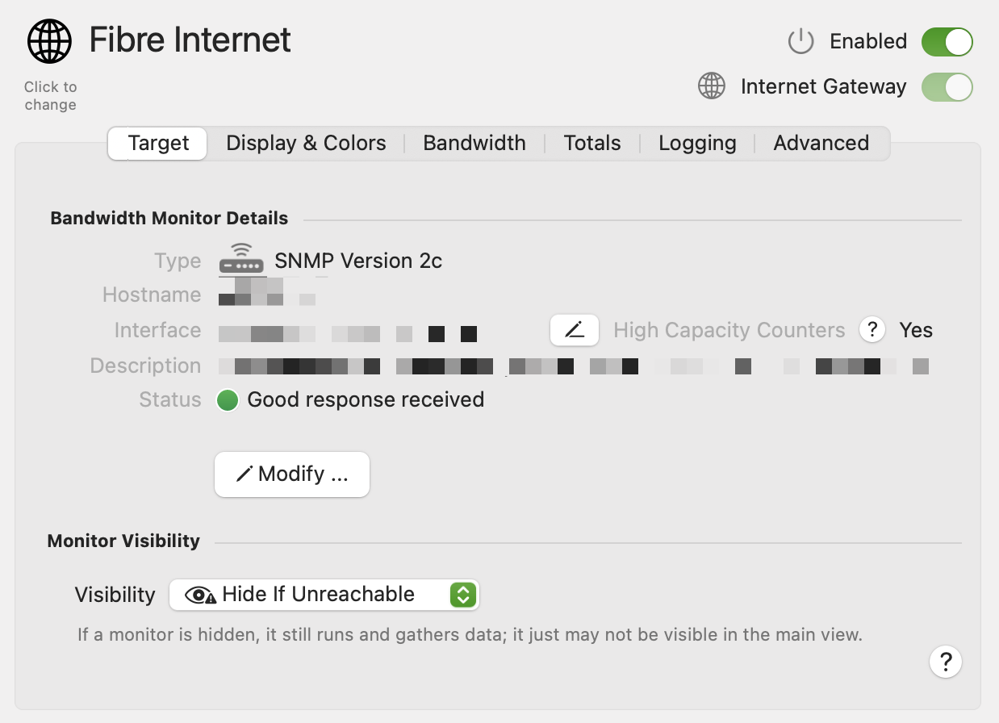

import NeedsReview from '@/components/NeedsReview.astro';

<NeedsReview />

The Target tab provides a summary of the Monitor, showing you information on how it’s configured.

<table>
<tbody>
<tr class="odd">
<td><strong>Symbol</strong></td>
<td>Choose a different symbol for this monitor by clicking the image. A symbol picker will open letting you search for and choose a different symbol. This symbol will be reflected in the main view, history view and (optionally) the menu bar, if this monitor is shown.</td>
</tr>
<tr class="even">
<td><strong>Description</strong></td>
<td>The name or description for the Monitor. The description is used throughout PeakHour to refer to it. Set this to something meaningful.</td>
</tr>
<tr class="odd">
<td><strong>Enabled</strong></td>
<td>Determines if this Target is enabled or disabled.</td>
</tr>
<tr class="even">
<td><strong>Internet Gateway</strong></td>
<td>Designates this Monitor as the Internet Gateway for your network. Internet Gateway devices are used for Usage Monitoring, and their throughput (upload/download) is displayed in the Internet Dashboard, if enabled.</td>
</tr>
<tr class="odd">
<td><strong>Visibility</strong></td>
<td>
Hide If Unreachable: Hide this Monitor if it can’t be reached or is otherwise offline.

Always Visible: Always show this Monitor.

Always Hide: Always hide this Monitor.
</td>
</tr>
<tr class="even">
<td><strong>Type</strong></td>
<td>The protocol being used to monitor this device: UPnP, SNMP version 1, SNMP version 2, SNMP version 3</td>
</tr>
<tr class="odd">
<td><strong>Description</strong></td>
<td><ul>
<li>
(SNMP) The system description (technically, the value of SNMPv2-MIB::sysDescr).
</li>
<li>
(UPnP) The friendly name
</li>
</ul></td>
</tr>
<tr class="even">
<td><strong>(SNMP) Hostname</strong></td>
<td>The hostname or IP address</td>
</tr>
<tr class="odd">
<td><strong>(SNMP) Interface</strong></td>
<td>The name of the interface being monitored</td>
</tr>
<tr class="even">
<td><strong>(UPnP) Address</strong></td>
<td>The root UPnP URL for the device</td>
</tr>
<tr class="odd">
<td><strong>(UPnP) UDID</strong></td>
<td>The Unique Device Identifier</td>
</tr>
<tr class="even">
<td><strong>Modify…</strong></td>
<td>Click this button to edit the Target's configuration. See <a href="/user-guide/configuration-assistant/">Configuration Assistant</a> for more information.</td>
</tr>
</tbody>
</table>

