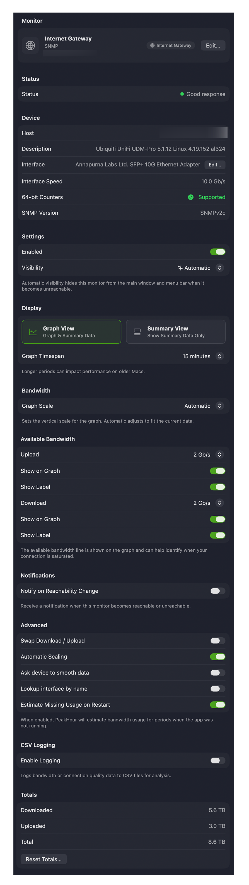

A Bandwidth Monitor measures the upload and download throughput of a device. Its settings are shown on a single scrolling page, organised into the sections below. To open them, select the monitor in the [Monitors](/user-guide/settings/monitors-settings/) list — or right-click it and choose **Edit…**.

## Monitor

The identity of the monitor.

| Field | Description |
|-------|-------------|
| **Symbol** | The icon for the monitor. Click it to open the symbol picker and choose a different one; it appears in the main view, History view, and (optionally) the menu bar. |
| **Name** | The description PeakHour uses to refer to this monitor throughout the app. Set something meaningful. |
| **Internet Gateway** | A pill shown when this monitor is designated as your network's Internet Gateway — used for usage monitoring, and its throughput appears in the [Internet Dashboard](/user-guide/main-view/internet-dashboard/). See [Designating a Monitor](/user-guide/settings/monitors-settings/#designating-a-monitor-for-the-internet-dashboard). |
| **Edit…** | Opens the [Configuration Assistant](/user-guide/configuration-assistant/configuration-assistant-bandwidth/) to change how the device is connected and monitored. |

## Status

Shows whether the device is currently responding to queries.

## Device

Connection details for the monitored device. The exact fields depend on whether it's monitored over SNMP or UPnP.

| Field | Description |
|-------|-------------|
| **Host** | The hostname or IP address (SNMP), or the root UPnP URL (UPnP). |
| **Description** | The system description — `sysDescr` for SNMP, or the friendly name for UPnP. |
| **Interface** | The name of the interface being monitored (SNMP). |
| **Interface Speed** | The reported link speed of the interface. |
| **64-bit Counters** | Whether the interface supports high-capacity (64-bit) counters, needed to measure high-speed links accurately. |
| **SNMP Version** | The SNMP version in use — v1, v2c, or v3 (SNMP devices). |

## Settings

| Field | Description |
|-------|-------------|
| **Enabled** | Turns monitoring of this device on or off. |
| **Visibility** | Whether the monitor appears in the main window. **Automatic** hides it when it can't be reached; **Always Visible** always shows it; **Always Hide** always hides it. A hidden monitor still runs and gathers data. |

## Display

Controls how the monitor appears in the main window.

**View mode**

- **Graph View** — shows the monitor with its graph as well as the details. You can also toggle the graph with the disclosure triangle.
- **Summary View** — shows just the inbound (download) and outbound (upload) speed, without the graph.

**Graph Threshold** — how many minutes of data the main graph retains. You can scroll the graph vertically to see up to 12 hours back; larger values can affect performance. For older data, use the [History view](/user-guide/history-view/).

**Colors** — set the **Download** and **Upload** colors used on the graph. To copy a color between monitors, drag it from one monitor's color well into another's.

:::note
If **Display → Fuel Gauges** is enabled, a gauge appears behind the speed numbers showing the current speed relative to the maximum bandwidth — see [Display](/user-guide/settings/display/). Clicking the upload/download numbers toggles between current speed and total traffic (see [Totals](#totals)).
:::

## Bandwidth

Sets the graph scale and the maximum throughput the device is capable of.

**Graph Scale**

- **Automatic** — the graph scales to fit whatever is currently on screen.
- **Available Bandwidth** — scales to the maximum inbound/outbound bandwidth (whichever is greater).
- **Fixed** — a specific fixed scale.

**Available Bandwidth** (upload and download) — the maximum throughput for the device. It's used to draw the maximum-bandwidth line and, when **Graph Scale** is **Available Bandwidth**, to scale the graph. Each direction can be:

- **Automatic** — calculated by observing throughput. Click **Reset** to set it to the current graph maximum.
- **Custom…** — enter a value in kbit/s, Mbit/s, KByte/s, or MByte/s.
- **Static** — choose a preset value.

For each direction, **Show on Graph** draws a line at the maximum level, and **Show Label** adds a numeric label to that line.

## Notifications

**Notify on Reachability Change** — posts a notification when this monitor becomes reachable or unreachable.

## Advanced

| Field | Description |
|-------|-------------|
| **Swap Up/Down** | Swaps inbound and outbound values — downloads become uploads and vice versa. Useful for devices that report traffic the wrong way around. |
| **Automatic Scale Factor** | When on, traffic is scaled 1×, except for certain Apple AirPort interfaces known to report incorrect data. Turn it off to set a manual **Adjust** scale factor, which affects throughput, graphs, bandwidth, totals, and usage. |
| **Estimate missed usage on restart** | When PeakHour restarts, it estimates any usage missed while it wasn't running. Disable to turn this off. |
| **Ask device to smooth data** *(SNMP only)* | Asks the device to refresh its counters every second instead of the default (often 5 s on macOS/Linux `snmpd`), producing smoother graphs where supported. |
| **Lookup interface by name** *(SNMP only)* | Tracks the interface by name rather than by numeric index, so PeakHour doesn't lose it when the index changes (e.g. after a reboot). May be incompatible with some devices. |

## Totals

Shows the total amount of data that has passed through the monitor, and lets you reset it.

**Total Traffic** — the total inbound, outbound, and combined traffic so far.

**Reset**

| Setting | Description |
|---------|-------------|
| **Automatically reset on the…** | When enabled, totals reset automatically on the chosen day of the month. |
| **(Day of the month)** | Which day to reset on. Set to **Every** to reset daily at the time below. |
| **(at)** | The hour to reset on. |
| **Reset…** | Reset the totals now. |

## CSV Logging

Logs activity to a CSV file you can open in Numbers, Excel, or similar.

**Log to file** — enable logging and choose the **Log location**. Because of app sandboxing, you must click **Choose…** to grant PeakHour permission to write there. **Reveal in Finder** opens that folder.

**Frequency**

| Setting | Description |
|---------|-------------|
| **Write to log every** | How often a new record (line) is written. |
| **Rotate log file** | How often a new log file is started. |

**Log state change events** — also writes an entry when the monitor's state changes (interface up/down, sleep/wake, PeakHour start/stop).

**Log filename** — files are stored in the **Log location** with a name based on the rotation frequency:

| Rotation | Filename |
|----------|----------|
| Hourly | `<Description> YY-MM-DD HH:MM.csv` |
| Daily | `<Description> YY-MM-DD.csv` |
| Weekly | `<Description> YY-MM-DD w.csv` (`w` = week number) |
| Monthly | `<Description> YY-MM.csv` |
| Yearly | `<Description> YYYY.csv` |

where `<Description>` is the monitor's name.

**Log format** — each row contains:

| Field | Description |
|-------|-------------|
| **Date/Time** | The entry's date and time in your local format. |
| **Target** | The monitor's description. |
| **Total In Bytes** / **Total Out Bytes** | Total inbound/outbound bytes since the last entry. |
| **Total In/Out Bytes (formatted)** | Formatted versions of the above. |
| **In Bytes/Sec** / **Out Bytes/Sec** | Average inbound/outbound bytes per second over the period. |
