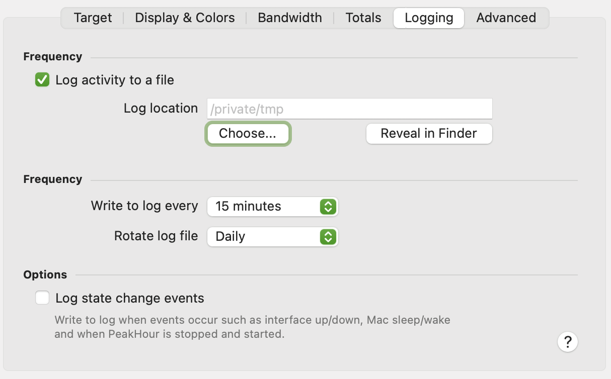

These allows you to log activity to a CSV file that can be imported and analysed in another application (e.g. Numbers or Microsoft Excel)

## Log to file

## Frequency

These options determine how often data is written to the file and (optionally) how often the files are rotated.

|                        |                                                             |
| ---------------------- | ----------------------------------------------------------- |
| **Write to log every** | How often to write a new record (line) in the CSV log file. |
| **Rotate log file**    | How often to start a new log file.                          |

## Options

|                             |                                                                                                                                                                                                                                            |
| --------------------------- | ------------------------------------------------------------------------------------------------------------------------------------------------------------------------------------------------------------------------------------------ |
| **Log state change events** | When this option is enabled, a log entry is written when the state of a Target changes. State changes events can include when the interface goes up / down, when the Mac goes to sleep or wakes up or when PeakHour is stopped or started. |

### Log filename

Log files are always stored in the **Log location** folder and have a different filename format depending on the log rotation frequency:

<table>
<colgroup>
<col style="width: 50%" />
<col style="width: 50%" />
</colgroup>
<thead>
<tr class="header">
<th><strong>Frequency</strong></th>
<th><strong>Format</strong></th>
</tr>
</thead>
<tbody>
<tr class="odd">
<td><strong>Hourly</strong></td>
<td>
<code>&lt;Target Description&gt; YY-MM-DD HH:MM.csv</code>

Where:

<ul>
<li>
<code>YY-MM-DD</code> is the date in Year-Month-Day
</li>
<li>
<code>HH:MM</code> is the time in Hour:Minutes
</li>
</ul></td>
</tr>
<tr class="even">
<td><strong>Daily</strong></td>
<td>
<code>&lt;Target Description&gt; YY-MM-DD.csv</code>

Where:

<ul>
<li>
<code>YY-MM-DD</code> is the date in Year-Month-Day
</li>
</ul></td>
</tr>
<tr class="odd">
<td><strong>Weekly</strong></td>
<td>
<code>&lt;Target Description&gt; YY-MM-DD w.csv</code>

Where:

<ul>
<li>
<code>YY-MM-DD</code> is the date in Year-Month-Day
</li>
<li>
<code>w</code> is the number of the week.
</li>
</ul></td>
</tr>
<tr class="even">
<td><strong>Monthly</strong></td>
<td>
<code>&lt;Target Description&gt; YY-MM.csv</code>

Where:

<ul>
<li>
<code>YY-MM</code> is the date in Year-Month
</li>
</ul></td>
</tr>
<tr class="odd">
<td><strong>Yearly</strong></td>
<td>
<code>&lt;Target Description&gt; YYYY.csv</code>

Where:

<ul>
<li>
<code>YYYY</code> is the year
</li>
</ul></td>
</tr>
</tbody>
</table>

`Target Description` is the description of the monitor configured in the **Target** tab.

## Log file format

The log file contains the following fields:

|                                 |                                                                                 |
| ------------------------------- | ------------------------------------------------------------------------------- |
| **Date/Time**                   | The date and time of the entry in your localised time format.                   |
| **Target**                      | The description of the target.                                                  |
| **Total In Bytes**              | An integer representing the total inbound bytes measured since the last entry.  |
| **Total Out Bytes**             | An integer representing the total outbound bytes measured since the last entry. |
| **Total In Bytes (formatted)**  | A formatted version of **Total In Bytes**                                       |
| **Total Out Bytes (formatted)** | A formatted version of **Total Out Bytes**                                      |
| **In Bytes/Sec**                | The average measured bytes/sec inbound over the period.                         |
| **Out Bytes/Sec**               | The average measured bytes/sec outbound over the period.                        |

