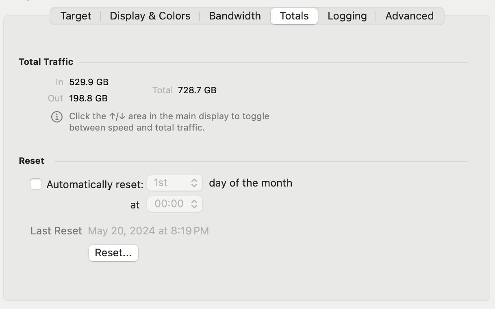

The **Totals** tab allows you to see the total amount of data that has passed through the Monitor.

Optionally, you can configure a day of the month to automatically reset this value to zero.

## Total Traffic

Displays the total Inbound, Outbound and combined total traffic so far.

## Reset

| **Setting**                       | **Description**                                                                                                                         |
| --------------------------------- | --------------------------------------------------------------------------------------------------------------------------------------- |
| **Automatically reset on the...** | When this checkbox is enabled, the totals will automatically reset on the given day of the month                                        |
| **(Day of the month)**            | Choose which day of the month to automatically reset totals on. If set to 'Every', totals will reset daily at the time specified below. |
| **(at)**                          | The hour to reset on.                                                                                                                   |
| **Reset...**                      | Reset the totals now                                                                                                                    |

