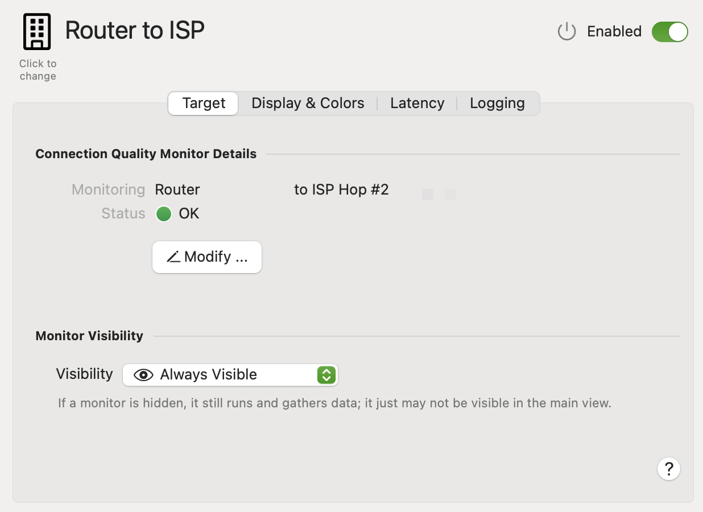

Connection Quality monitors ping a target or host (or set of targets/hosts) to determine the latency to that host. For more information on Connection Quality Monitors, see [Configuration Assistant: Connection Quality](/user-guide/configuration-assistant/configuration-assistant-connection-quality/) .

The Target tab provides a summary of the Connection Quality target, and lets you control its visibility.

**Symbol**

Choose a different symbol for this monitor by clicking the image. A symbol picker will open letting you search for and choose a different symbol. This symbol will be reflected in the main view, history view and (optionally) the menu bar, if this monitor is shown.

**Description**

This field lets you configure a description or name for this monitor. The description is used throughout PeakHour to refer to the target, so it's recommended that you set something that is meaningful to you.

**Enabled**

Determines if this Target is enabled or disabled.

**Visibility**

**Hide If Unreachable:** Hide this Monitor if it can’t be reached or is otherwise offline.

**Always Visible:** Always show this Monitor.

**Always Hide:** Always hide this Monitor.

**Status**

The status of this Target. If this is a Multi-Host and it has an error, the target (Near) or (Far) will indicate if the error is associated with the near or the far host.

**Monitoring**

A description of what this Target is monitoring.

**Modify**

Click this button to edit the Target's configuration. See [Configuration Assistant](/user-guide/configuration-assistant/) for more information.

