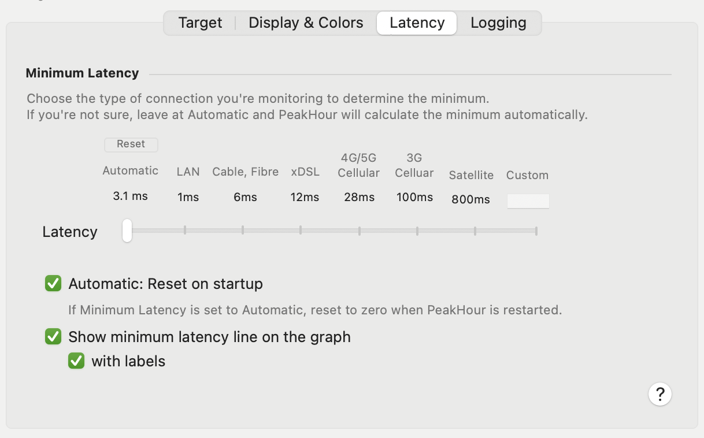

Options on this tab allow you to adjust what PeakHour considers 'normal' latency for what you are monitoring.

By default, PeakHour will automatically detect and measure the minimum latency. By default, this minimum latency will reset every time PeakHour is restarted, or monitors are reset. This minimum (or normal) latency is used a baseline for Normal, Light Congestion and Heavy Congestion states and colors, configured in [Display & Colors \[Connection Quality\]](/user-guide/settings/monitors-settings/connection-quality-monitor/display-colors-connection-quality/) . These are visualized in the color of the text, background (optional) and graph of the monitor.

<table>
<tbody>
<tr class="odd">
<td><strong>Latency</strong></td>
<td>
This slider lets you adjust what is considered the minimum latency for the connection. By default, this is calculated automatically.

The minimum latency is used to calculate the colors used when displaying the latency and latency graph.
</td>
</tr>
<tr class="even">
<td><strong>Automatic: Reset on start</strong></td>
<td>If Latency is set to Automatic, this will reset the minimum latency every time PeakHour starts, or monitors are reset. This is on by default.</td>
</tr>
<tr class="odd">
<td><strong>Show minimum latency on graph</strong></td>
<td>Turns the minimum latency line display in the graph on or off.</td>
</tr>
<tr class="even">
<td><strong>With labels</strong></td>
<td>Include the minimum latency value on the line.</td>
</tr>
</tbody>
</table>

