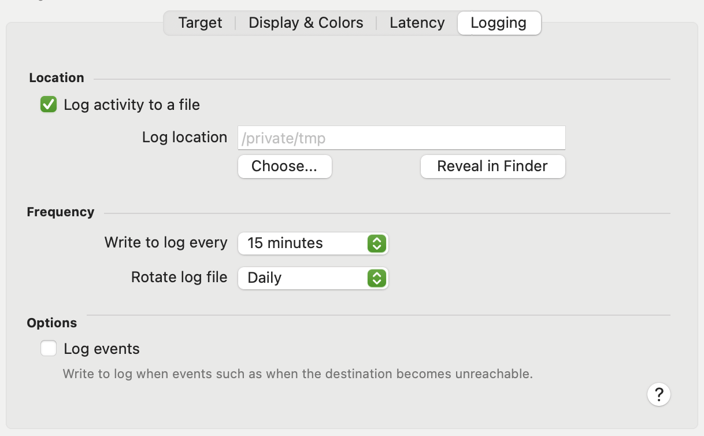

These options allow you to enable logging of activity to a CSV file that can be imported and analyzed in another application (e.g. Numbers or Microsoft Excel)

## Log to file

<table>
<tbody>
<tr class="odd">
<td><strong>Log activity to a file</strong></td>
<td>When this checkbox is enabled, average latency values will be written to file(s) in Log location.</td>
</tr>
<tr class="even">
<td><strong>Log location</strong></td>
<td>
The location to store the log file.

Note: Due to the requirement for App Sandboxing, you must click <strong>Choose...</strong> to choose a location for the files to be stored, otherwise PeakHour will not be granted permission to write there.
</td>
</tr>
<tr class="odd">
<td><strong>Reveal in Finder</strong></td>
<td>Opens the chosen folder in Finder.</td>
</tr>
</tbody>
</table>

## Frequency

These options determine how often data is written to the file and (optionally) how often the files are rotated.

|                        |                                                             |
| ---------------------- | ----------------------------------------------------------- |
| **Write to log every** | How often to write a new record (line) in the CSV log file. |
| **Rotate log file**    | How often to start a new log file.                          |

Log filename

Log files are always stored in the **Log location** folder and have a different filename format depending on the log rotation frequency:

<table>
<thead>
<tr class="header">
<th><strong>Frequency</strong></th>
<th><strong>Format</strong></th>
</tr>
</thead>
<tbody>
<tr class="odd">
<td><strong>Hourly</strong></td>
<td>
<code>&lt;Target Description&gt; YY-MM-DD HH:MM.csv</code>

Where:

<ul>
<li>
<code>YY-MM-DD</code> is the date in Year-Month-Day
</li>
<li>
<code>HH:MM</code> is the time in Hour:Minutes
</li>
</ul></td>
</tr>
<tr class="even">
<td><strong>Daily</strong></td>
<td>
<code>&lt;Target Description&gt; YY-MM-DD.csv</code>

Where:

<ul>
<li>
<code>YY-MM-DD</code> is the date in Year-Month-Day
</li>
</ul></td>
</tr>
<tr class="odd">
<td><strong>Weekly</strong></td>
<td>
<code>&lt;Target Description&gt; YY-MM-DD w.csv</code>

Where:

<ul>
<li>
<code>YY-MM-DD</code> is the date in Year-Month-Day
</li>
<li>
<code>w</code> is the number of the week.
</li>
</ul></td>
</tr>
<tr class="even">
<td><strong>Monthly</strong></td>
<td>
<code>&lt;Target Description&gt; YY-MM.csv</code>

Where:

<ul>
<li>
<code>YY-MM</code> is the date in Year-Month
</li>
</ul></td>
</tr>
<tr class="odd">
<td><strong>Yearly</strong></td>
<td>
<code>&lt;Target Description&gt; YYYY.csv</code>

Where:

<ul>
<li>
<code>YYYY</code> is the year
</li>
</ul></td>
</tr>
</tbody>
</table>

`Target Description` is the description you've entered on the **Target** tab.

## Log format

The log file contains the following fields:

|                                |                                                               |
| ------------------------------ | ------------------------------------------------------------- |
| **Date/Time**                  | The date and time of the entry in your localised time format. |
| **Target**                     | The description of the target.                                |
| **Average Response Time (ms)** | The average latency / response time over the period.          |

