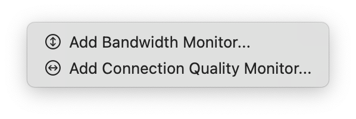
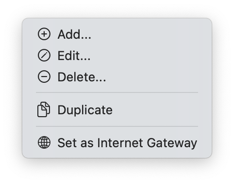

import NeedsReview from '@/components/NeedsReview.astro';

<NeedsReview />

The Monitors lets you manage your list of Monitors.

## Adding a new Monitor

To create a new monitor, click the **+** button in the bottom left-hand corner. This will display a sub-menu:

  - **Add Bandwidth Monitor**  
    Add a new Bandwidth Monitor to monitor the amount of data uploaded and download through your Mac, a network device, server or PC.  
    For more information on Bandwidth Monitors, see here: [Bandwidth Monitor](/user-guide/settings/monitors-settings/bandwidth-monitor/).  
    For more information on what Bandwidth Monitors can track, see here: [Bandwidth Monitoring FAQ](https://peakhoursupport.atlassian.net/wiki/spaces/P4W/pages/327709/Bandwidth+Monitoring+FAQ).  

  - **Add Connection Quality Monitor**  
    Add a new Connection Quality monitor to measure and monitor latency. For more information on Connection Quality monitors, see here: [Connection Quality Monitor](/user-guide/settings/monitors-settings/connection-quality-monitor/).

## Deleting a Monitor

To remove a Monitor, select it in the list and click the **-** button. You can also right-click a target in the main window and choose **Delete...**.

You will be asked to confirm your action.

## Editing a Monitor

To edit a Monitor, click the Edit… button or right-click and choose Edit. This will open the Monitor in the Configuration Assistant and allow you to make changes.

## Duplicating a Target

If you wish to duplicate an existing target, right-click on an existing target and choose **Duplicate**.

## Tabs

Click the sections below for info on each monitor type and tab:

### Bandwidth Monitor

### Connection Quality Monitor

