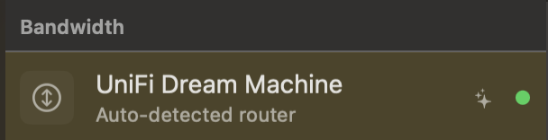
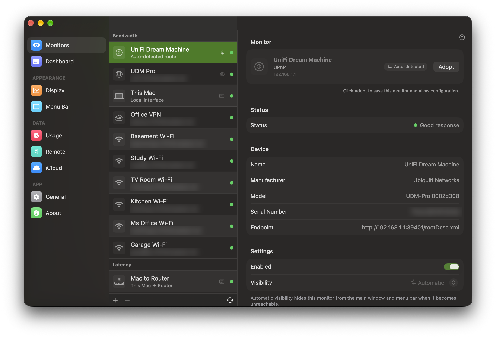
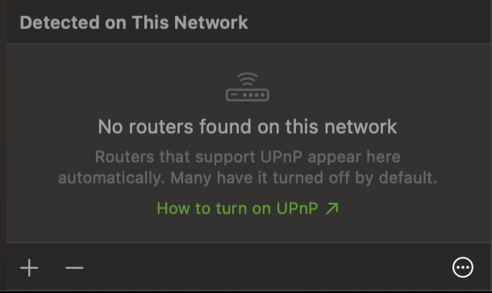

The **Monitors** settings let you manage your list of monitors — add new ones, adopt routers PeakHour has detected on your network, and edit, duplicate, or remove existing ones.

## Adding a new Monitor

To create a new monitor, click the  button in the bottom-left corner.

This opens the [Configuration Assistant](/user-guide/configuration-assistant/). Its first page asks which type of monitor to create:

- **Bandwidth** — measures the data uploaded and downloaded through your Mac, a network device, server, or PC. See the [Bandwidth Configuration Assistant](/user-guide/configuration-assistant/configuration-assistant-bandwidth/) and [Bandwidth Monitor settings](/user-guide/settings/monitors-settings/bandwidth-monitor/).
- **Latency** — measures the latency and connection quality to a host or hop on your network path. See the [Latency Configuration Assistant](/user-guide/configuration-assistant/configuration-assistant-latency/) and [Latency Monitor settings](/user-guide/settings/monitors-settings/latency-monitor/).

## Routers detected automatically

When you join a network, PeakHour looks for its router. If the router supports UPnP, it appears at the top of the **Bandwidth** section with no setup at all — no IP address, no credentials. It starts graphing straight away, and the [Internet Dashboard](/user-guide/main-view/internet-dashboard/) can use it as your Internet Gateway.

A detected router is easy to spot: its row is tinted yellow, it carries a ✨ sparkles badge, and its subtitle reads **Auto-detected router**. When you select it, its header shows an **Auto-detected** pill.

Router detection is on by default. If you see a monitor you don't remember adding, this is almost certainly where it came from.

### A detected router isn't saved

The one thing to understand about a detected router is that it's a live view of the network you're on — **not part of your configuration**. Nothing is saved until you click **Adopt**. That explains how it behaves:

- **Its settings are locked.** You can watch its graph and status, but you can't rename it or change its settings until you adopt it. The header reminds you: *Click Adopt to save this monitor and allow configuration.*
- **It can't be deleted or duplicated.** There's nothing saved to delete, so the **-** button is unavailable while it's selected. If you don't want detected routers at all, [turn detection off](#turning-router-detection-off).
- **Usage isn't counted against it.** When **Track Usage For** is set to **Automatic** in the [Usage settings](/user-guide/settings/usage/#track-usage-for), usage follows your Internet Gateway — but never a router you haven't adopted. Even if a detected router becomes the Internet Gateway, PeakHour pauses usage counting rather than adding a café or hotel network to your totals.
- **It comes and goes with the network.** Leave the network and the detected router disappears from the list. Come back and it returns, with the history it had already collected. The monitors you've added yourself are always listed, wherever you are.

### Adopting a detected router

To keep a detected router, click **Adopt** in its header, or right-click it in the list and choose **Adopt**.

PeakHour saves it to your configuration and it becomes an ordinary bandwidth monitor. The yellow tint and the sparkles badge go away, it keeps its history, and you can rename it, change its settings, edit it in the Configuration Assistant, or delete it like any other monitor. It stays in your list when you leave the network.

### Which routers appear

- **UPnP routers only.** Monitoring over SNMP needs credentials, so it can never be set up without you. A router or managed switch that only supports SNMP won't appear here — add it with the  button instead.
- **One router at a time.** PeakHour shows at most one detected router, even if your Mac is connected to more than one network (for example, Wi-Fi and Ethernet at once). It prefers the router your Mac uses to reach the internet, so on a mesh Wi-Fi system you'll see the main router rather than every node.
- **Not routers you already monitor.** If you already have a monitor for the router, PeakHour doesn't add a second copy.
- **Only routers that report traffic.** A device that answers UPnP but doesn't report how much data it's passing isn't shown, because it could never draw a graph. On a very quiet connection, PeakHour may need to see the router twice before it appears.

### When nothing is detected

If no router has been found, a **Detected on This Network** section appears at the bottom of the Monitors list. It reads **Discovering routers…** while PeakHour is looking, and **No routers found on this network** once it has finished.

The most common reason is that UPnP is switched off at the router — many routers ship with it off. The **How to turn on UPnP** link in that section takes you to [How do I turn on UPnP on my router?](/troubleshooting/upnp/turn-on-upnp/), which also explains what switching it on means for your network.

### The one-time notice

The first time you open the Monitors settings with detection on, a notice at the top of the pane explains the feature: *PeakHour now shows routers it finds on the networks you join. Click Adopt on one to save it permanently.*

- Click **Turn Off** to switch router detection off and close the notice.
- Click **×** to close the notice and leave detection on.

Either way, the notice doesn't come back. You can change the setting at any time from the ⋯ menu.

### Turning router detection off

Click the **⋯** button at the bottom-right of the Monitors list and uncheck **Detect Routers Automatically**. Any detected routers are removed from the list straight away. Routers you've already adopted are yours and stay where they are.

To turn detection back on, check **Detect Routers Automatically** in the same menu.

## Deleting a Monitor

To remove a Monitor, select it in the list and click the **-** button. You can also right-click a monitor in the main window and choose **Delete...**.

You will be asked to confirm your action. A [detected router](#routers-detected-automatically) can't be deleted until you adopt it.

## Editing a Monitor

To edit a Monitor, click the Edit… button or right-click and choose Edit. This will open the Monitor in the Configuration Assistant and allow you to make changes.

## Duplicating a Monitor

To duplicate an existing monitor, right-click it and choose **Duplicate**.

## Designating a Monitor for the Internet Dashboard

The [Internet Dashboard](/user-guide/main-view/internet-dashboard/) is built from specific monitors — the bandwidth of your Internet Gateway and the latency of each hop along the path to the internet. Right-click a monitor and choose **Designate as** to assign it to one of these roles, controlling which monitors feed the dashboard. The available roles depend on the monitor type.

A **Bandwidth Monitor** can be designated as the **Internet Gateway** — the router whose throughput the dashboard shows:

:::note
By default, PeakHour automatically chooses the most appropriate monitor to act as the Internet Gateway. You can tell which one is selected by the **Internet Gateway** pill in the monitor's settings and the Internet Gateway icon next to it in the list. Use **Designate as → Internet Gateway** to override this automatic choice.
:::

A **Latency Monitor** can be designated as any of the dashboard's latency hops:

| Role | What it measures |
|------|------------------|
| **This Mac to Router** | Latency from your Mac to your local gateway. |
| **Router to ISP** | Latency from your router out to your ISP. |
| **Internet 1**, **2**, **3** | Latency to each of the three internet hosts the dashboard tracks. |

A checkmark marks the monitor currently designated for each role.

## Monitor types

For details on each monitor type and its settings tabs, see:

- [Bandwidth Monitor](/user-guide/settings/monitors-settings/bandwidth-monitor/)
- [Latency Monitor](/user-guide/settings/monitors-settings/latency-monitor/)

