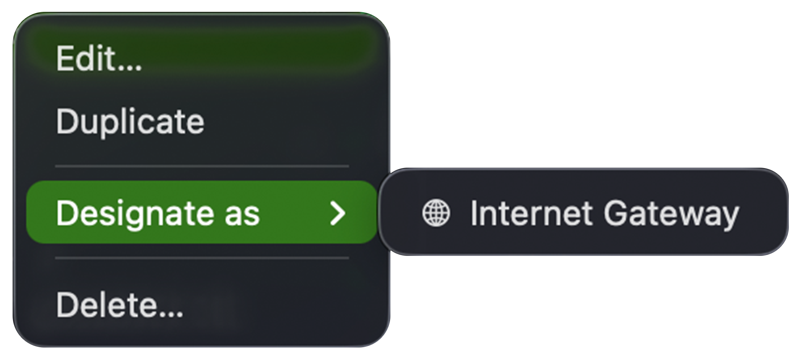
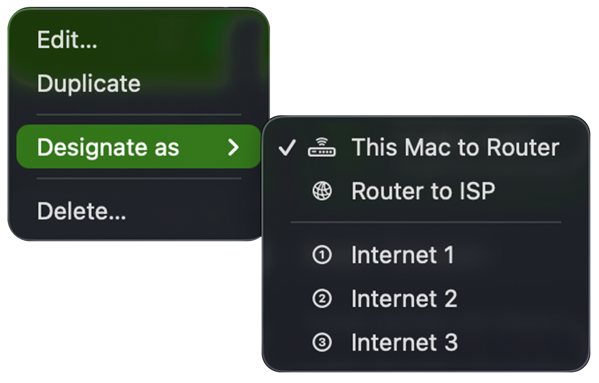

The **Monitors** settings let you manage your list of monitors — add new ones, and edit, duplicate, or remove existing ones.

## Adding a new Monitor

To create a new monitor, click the  button in the bottom-left corner.

This opens the [Configuration Assistant](/user-guide/configuration-assistant/). Its first page asks which type of monitor to create:

- **Bandwidth** — measures the data uploaded and downloaded through your Mac, a network device, server, or PC. See the [Bandwidth Configuration Assistant](/user-guide/configuration-assistant/configuration-assistant-bandwidth/) and [Bandwidth Monitor settings](/user-guide/settings/monitors-settings/bandwidth-monitor/).
- **Latency** — measures the latency and connection quality to a host or hop on your network path. See the [Latency Configuration Assistant](/user-guide/configuration-assistant/configuration-assistant-latency/) and [Latency Monitor settings](/user-guide/settings/monitors-settings/latency-monitor/).

## Deleting a Monitor

To remove a Monitor, select it in the list and click the **-** button. You can also right-click a monitor in the main window and choose **Delete...**.

You will be asked to confirm your action.

## Editing a Monitor

To edit a Monitor, click the Edit… button or right-click and choose Edit. This will open the Monitor in the Configuration Assistant and allow you to make changes.

## Duplicating a Monitor

To duplicate an existing monitor, right-click it and choose **Duplicate**.

## Designating a Monitor for the Internet Dashboard

The [Internet Dashboard](/user-guide/main-view/internet-dashboard/) is built from specific monitors — the bandwidth of your Internet Gateway and the latency of each hop along the path to the internet. Right-click a monitor and choose **Designate as** to assign it to one of these roles, controlling which monitors feed the dashboard. The available roles depend on the monitor type.

A **Bandwidth Monitor** can be designated as the **Internet Gateway** — the router whose throughput the dashboard shows:

:::note
By default, PeakHour automatically chooses the most appropriate monitor to act as the Internet Gateway. You can tell which one is selected by the **Internet Gateway** pill in the monitor's settings and the Internet Gateway icon next to it in the list. Use **Designate as → Internet Gateway** to override this automatic choice.
:::

A **Latency Monitor** can be designated as any of the dashboard's latency hops:

| Role | What it measures |
|------|------------------|
| **This Mac to Router** | Latency from your Mac to your local gateway. |
| **Router to ISP** | Latency from your router out to your ISP. |
| **Internet 1**, **2**, **3** | Latency to each of the three internet hosts the dashboard tracks. |

A checkmark marks the monitor currently designated for each role.

## Monitor types

For details on each monitor type and its settings tabs, see:

- [Bandwidth Monitor](/user-guide/settings/monitors-settings/bandwidth-monitor/)
- [Latency Monitor](/user-guide/settings/monitors-settings/latency-monitor/)

