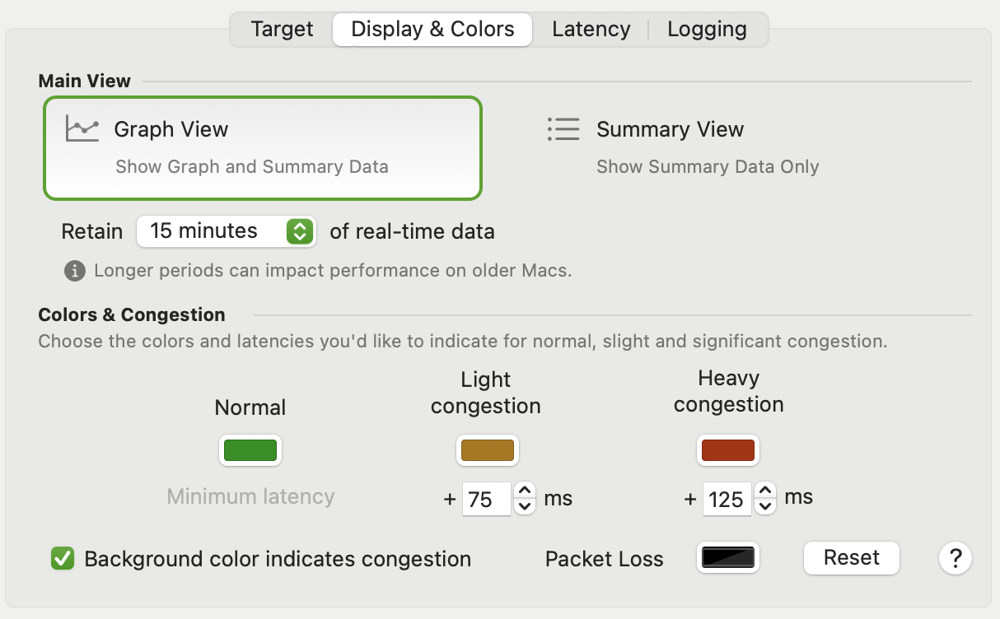
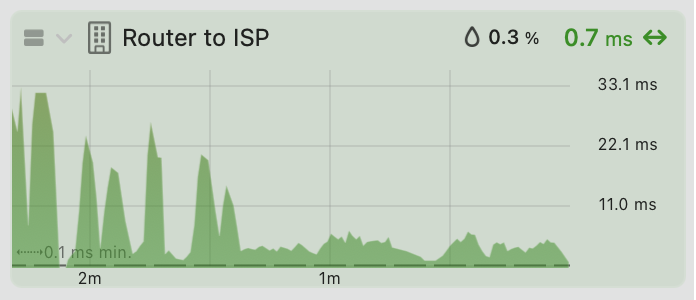
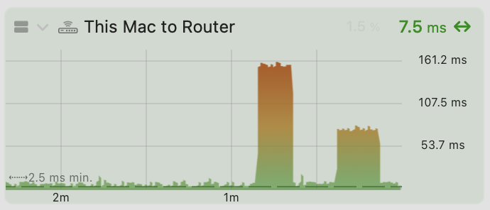
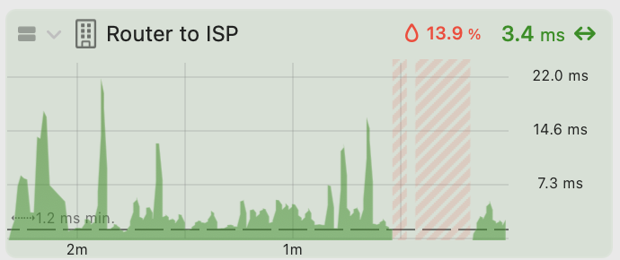
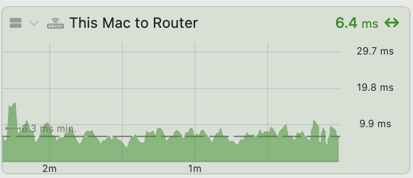
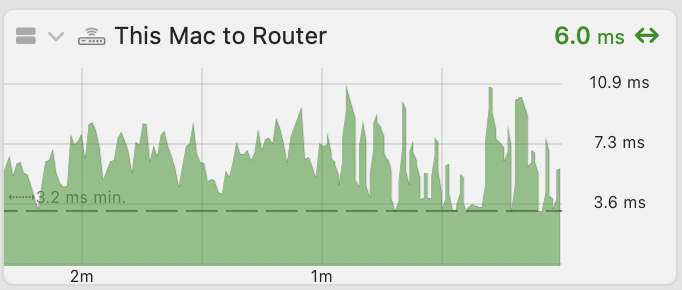

The **Display** tab contains options for customising how the device is displayed.

## View

**Graph View**

Sets the view of the target in the main window to include a graph as well as details. You can also toggle the graph on and off by clicking the disclosure triangle.

**Details Only View**

Details only shows device and immediate inbound/outbound bandwidth but hides the graph.

**Retain**

Sets how many minutes of data the main graph will retain. The main graph can be scrolled vertically with either the mouse or trackpad, allowing you to see data up to 12 hours in the past. Note that larger values here can impact performance.

## Colors

Here you can customize the colors that are used to indicate latency. The monitor uses colors to indicate relative latency. Colors are blended from Normal (minimum latency) up to Light congestion up to Heavy congestion using a gradient. Also, if configured, the background of the monitor will change to reflect the latency as well.

# Colors

**Normal**

This is the base color that represents 'good' or 'optimum' connection quality. How the minimum latency is calculated can be configured under [Latency options](/user-guide/settings/monitors-settings/latency-monitor/latency-options/) .

**Light Congestion**

The color that represents slight congestion.

**Light Congestion Latency**

This value adjusts what is considered 'slight' congestion. By default, **Slight congestion** = **Normal latency** + 75ms.

**Heavy Congestion**

The color that represents significant congestion.

**Heavy Congestion Latency**

This value adjusts what is considered 'significant' congestion. By default, **Significant congestion** = **Minimum latency** + **Slight congestion latency** + 125ms.

**Packet Loss**

The color that represents packet loss. Packet Loss isn’t plotted on the graph as a series, rather it is shown as a grey

## Options

**Background color indicates congestion**

When enabled, the background of the details view is blended with the current latency color.

**Enabled**

**Disabled**

