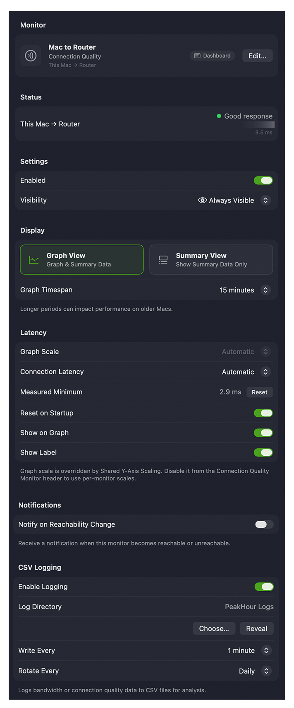

A Latency Monitor pings a host or hop and measures the round-trip time. Its settings are shown on a single scrolling page, organised into the sections below. To open them, select the monitor in the [Monitors](/user-guide/settings/monitors-settings/) list — or right-click it and choose **Edit…**.

## Monitor

The identity of the monitor.

| Field | Description |
|-------|-------------|
| **Symbol** | The icon for the monitor. Click it to choose a different one from the symbol picker; it appears in the main view, History view, and (optionally) the menu bar. |
| **Name** | The description PeakHour uses to refer to this monitor throughout the app. Set something meaningful. |
| **Dashboard role** | A pill showing which [Internet Dashboard](/user-guide/main-view/internet-dashboard/) hop this monitor is designated as (for example, **This Mac to Router**), if any. See [Designating a Monitor](/user-guide/settings/monitors-settings/#designating-a-monitor-for-the-internet-dashboard). |
| **Edit…** | Opens the [Configuration Assistant](/user-guide/configuration-assistant/configuration-assistant-latency/) to change what's measured. |

## Status

Shows the monitor's current status and what it's monitoring. For a multi-host monitor, an error is labelled **(Near)** or **(Far)** to show which end it relates to.

## Settings

| Field | Description |
|-------|-------------|
| **Enabled** | Turns monitoring on or off. |
| **Visibility** | Whether the monitor appears in the main window. **Automatic** hides it when it can't be reached; **Always Visible** always shows it; **Always Hide** always hides it. A hidden monitor still runs and gathers data. |

## Display

Controls how the monitor appears in the main window.

**View mode**

- **Graph View** — shows the monitor with its graph as well as the details. You can also toggle the graph with the disclosure triangle.
- **Summary View** — shows the details only, hiding the graph.

**Graph Timespan** — how many minutes of data the main graph retains. You can scroll the graph vertically to see up to 12 hours back; larger values can affect performance. For older data, use the [History view](/user-guide/history-view/).

Latency colors and the congestion thresholds that drive them are set globally for all monitors — see [Display → Latency Colors](/user-guide/settings/display/#latency-colors) and [Congestion Thresholds](/user-guide/settings/display/#congestion-thresholds). Each monitor's own minimum-latency baseline, set under [Latency](#latency) below, determines where those thresholds apply.

## Latency

Adjusts what PeakHour treats as 'normal' (minimum) latency — the baseline for the Normal, Slight Congestion, and Heavy Congestion colors.

| Field | Description |
|-------|-------------|
| **Connection Latency** | The minimum-latency baseline. **Automatic** detects and measures it for you; or drag the slider to set it manually. |
| **Measured Minimum** | The currently measured minimum latency. Click **Reset** to re-measure. |
| **Reset on Startup** *(Automatic only)* | Resets the minimum each time PeakHour starts or monitors are reset. On by default. |
| **Show on Graph** | Draws the minimum-latency line on the graph. |
| **Show Label** | Adds the minimum value to that line. |

## Notifications

**Notify on Reachability Change** — posts a notification when this monitor becomes reachable or unreachable.

## CSV Logging

Logs average latency to a CSV file you can open in Numbers, Excel, or similar.

**Log to file** — enable logging and choose the **Log Directory**. Because of app sandboxing, you must click **Choose…** to grant PeakHour permission to write there. **Reveal** opens that folder in Finder.

**Frequency**

| Setting | Description |
|---------|-------------|
| **Write Every** | How often a new record (line) is written. |
| **Rotate Every** | How often a new log file is started. |

**Log filename** — files are stored in the **Log Directory** with a name based on the rotation frequency:

| Rotation | Filename |
|----------|----------|
| Hourly | `<Description> YY-MM-DD HH:MM.csv` |
| Daily | `<Description> YY-MM-DD.csv` |
| Weekly | `<Description> YY-MM-DD w.csv` (`w` = week number) |
| Monthly | `<Description> YY-MM.csv` |
| Yearly | `<Description> YYYY.csv` |

where `<Description>` is the monitor's name.

**Log format** — each row contains:

| Field | Description |
|-------|-------------|
| **Date/Time** | The entry's date and time in your local format. |
| **Target** | The monitor's description. |
| **Average Response Time (ms)** | The average latency over the period. |
