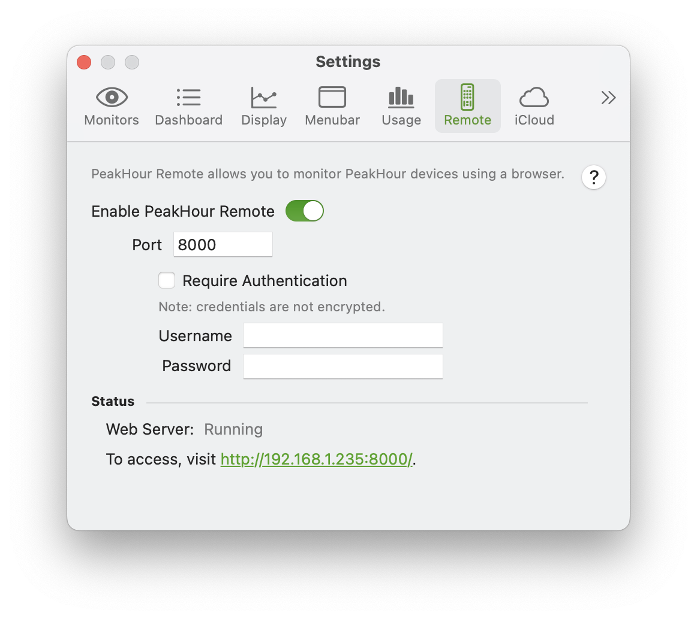
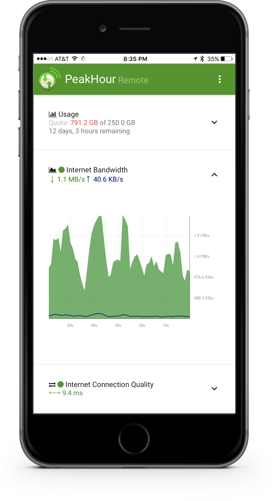

import NeedsReview from '@/components/NeedsReview.astro';

<NeedsReview />

[Settings](#Remote-Settings) | [Using PeakHour Remote](#Remote-UsingPeakHourRemote) | [Adding PeakHour Remote to your phone or tablet's Home Screen.](#Remote-AddingPeakHourRemotetoyourphoneortablet'sHomeScreen.)

PeakHour Remote allows you to monitor your PeakHour Monitors from your web browser. This allows you to view usage and performance from a different device than the one PeakHour is running on.

To access PeakHour Remote, ensure **Enable PeakHour Remote** is checked and then visit the URL at the bottom of the pane in Preferences.

# Settings

<table>
<tbody>
<tr class="odd">
<td><strong>Enable PeakHour Remote</strong></td>
<td>Starts the PeakHour Remote web application on the specified port.</td>
</tr>
<tr class="even">
<td><strong>Port</strong></td>
<td>
The port that PeakHour Remote listens on. Defaults to port 8000.

<strong>Note:</strong> If another application is using the port, PeakHour Remote will fail to start and an error will be shown in <strong>Status</strong>. To fix this, change to a different port and restart PeakHour Remote.
</td>
</tr>
<tr class="odd">
<td><strong>Require Authentication</strong></td>
<td>If this option is enabled, you will be prompted to enter the username and password you specify below it in order to access PeakHour Remote.</td>
</tr>
<tr class="even">
<td><strong>Username</strong></td>
<td>If <strong>Require Authentication</strong> is enabled, you will be required to enter this username.</td>
</tr>
<tr class="odd">
<td><strong>Password</strong></td>
<td>If <strong>Require Authentication</strong> is enabled, you will be required to enter this password.</td>
</tr>
</tbody>
</table>

Important: Connections to PeakHour Remote are **not encrypted**. That means that if you enable authentication, your credentials will not be encrypted when they are sent over the network. For this reason we **do not recommend** exposing PeakHour Remote directly to the Internet unless you add additional security such as a VPN.

# Using PeakHour Remote

PeakHour Remote is a React-based web application that works in most modern web browsers. The UI is 'responsive' and will automatically size to your screen, from a phone up to a desktop/laptop.

To access PeakHour Remote, visit the link at the bottom of the **Remote** Preferences pane.

In PeakHour Remote, your Targets will be shown a long with a summary of each. To view the graph, tap the section to expand it. If Usage Monitoring is enabled, details of your usage will be displayed at the top.

### Adding PeakHour Remote to your phone or tablet's Home Screen.

One of the most convenient uses of PeakHour Remote is to add it to your phone's home screen. For instructions on how to do this, tap the ... button in the top-right corner of PeakHour Remote and tap **Add to Home** Screen. This will add an icon to your iOS or Android phone or tablet's Home Screen. Tapping this icon will launch PeakHour Remote as a full-screen application.

