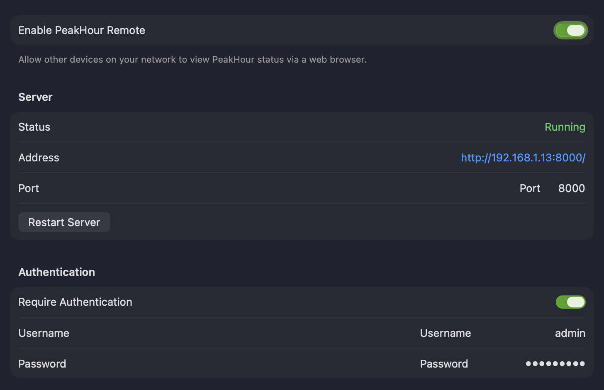
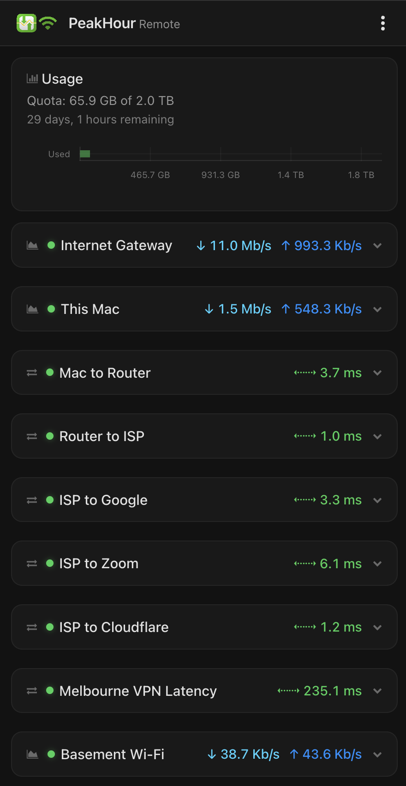

**PeakHour Remote** lets you view your monitors from a web browser on another device — handy for checking usage and performance from your phone, tablet, or another computer.

Enable it here, then open the **Address** shown in the settings from any device on your network.

**Enable PeakHour Remote** — starts the PeakHour Remote web server, allowing other devices on your network to view PeakHour's status in a browser.

## Server

| Field | Description |
|-------|-------------|
| **Status** | Whether the server is **Running**. If it can't start — for example, the port is already in use — the error is shown here. |
| **Address** | The URL for opening PeakHour Remote in a browser (e.g. `http://192.168.1.13:8000/`). Open it from any device on your network. |
| **Port** | The port the server listens on (default 8000). If another app is using it, change to a free port and restart the server. |
| **Restart Server** | Restarts the PeakHour Remote server — use this after changing the port. |

## Authentication

| Field | Description |
|-------|-------------|
| **Require Authentication** | When enabled, viewers must enter the username and password below to access PeakHour Remote. |
| **Username** | The username required when authentication is enabled. |
| **Password** | The password required when authentication is enabled. |

:::caution
Connections to PeakHour Remote are **not encrypted**, so credentials are sent over the network in the clear. Don't expose PeakHour Remote directly to the internet — if you need access from outside your network, reach it through a VPN. [Tailscale](https://tailscale.com) is a simple option: it creates a private, encrypted network between your devices, so you can open the **Address** from anywhere without opening any ports on your router.
:::

## Using PeakHour Remote

PeakHour Remote is a web app that works in most modern browsers. Its layout is responsive, sizing itself from a phone up to a desktop. Open the **Address** from the settings, and your monitors appear with a summary of each — tap one to expand its graph. When Usage Monitoring is enabled, your usage is shown at the top.

### Add to your Home Screen

A convenient way to use PeakHour Remote is to add it to your phone or tablet's Home Screen: in PeakHour Remote, tap the **…** button in the top-right and choose **Add to Home Screen**. Tapping the new icon launches PeakHour Remote as a full-screen app.
