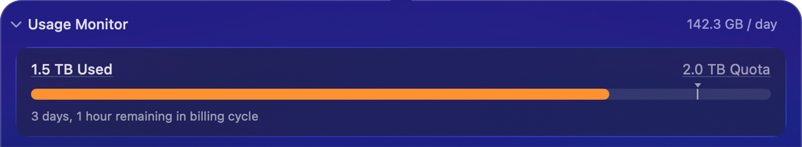
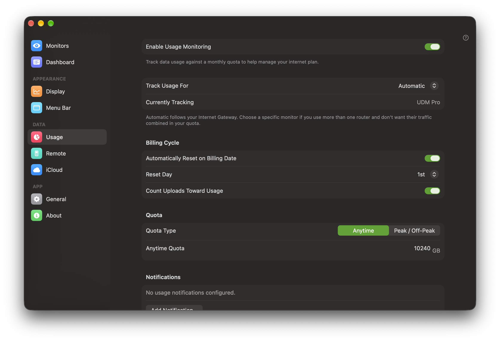

Usage Monitoring provides a real-time view of your Internet usage. You can set a monthly quota and reset date and PeakHour will then track your usage, showing how much you have remaining.

The Usage Monitor view shows, at a glance:

| Element | Description |
|---------|-------------|
| **Daily rate** | The average data used per day this billing cycle, shown top-right (e.g. 142.3 GB / day). |
| **Data used** | The total data consumed so far in the current billing cycle (e.g. 1.5 TB Used). |
| **Quota** | Your configured monthly data allowance, shown top-right of the bar (e.g. 2.0 TB Quota). Set this under [Quota](#quota) below. |
| **Progress bar** | Fills as you consume data, showing usage relative to your quota. The marker indicates where your usage should be to stay on pace for the cycle. |
| **Time remaining** | How long is left before your usage resets (e.g. 3 days, 1 hour remaining in billing cycle), based on your [reset day](#billing-cycle). |

# Usage settings

Configure Usage Monitoring under **Settings → Usage**. By default, PeakHour tracks usage of the monitor designated as your Internet Gateway. Use [Track Usage For](#track-usage-for) to choose a specific monitor instead.

## Enable Usage Monitoring

Turns Usage Monitoring on or off. When enabled, PeakHour tracks your data usage against a monthly quota to help you manage your internet plan.

## Track Usage For

Chooses which bandwidth monitor your usage is counted against.

- **Automatic** (the default) — follows your Internet Gateway. PeakHour chooses the gateway automatically, or you can pick one with **Designate as → Internet Gateway** on the [Monitors](/user-guide/settings/monitors-settings/#designating-a-monitor-for-the-internet-dashboard) tab. **Currently Tracking** shows which monitor that is right now. A router PeakHour has [detected but you haven't adopted](/user-guide/settings/monitors-settings/#a-detected-router-isnt-saved) is never counted: while one is your Internet Gateway, usage counting pauses and **Currently Tracking** reads **No Internet Gateway detected**.
- **A specific monitor** — counts only that monitor, wherever you are. Choose this if you use more than one router, or take your Mac between networks, and don't want other connections mixed into your quota. If you later delete that monitor, usage counting stops until you choose another.

## Billing Cycle

**Automatically Reset on Billing Date**

When enabled, your usage resets automatically each billing cycle on the chosen **Reset Day**. When disabled, PeakHour operates in "pre-paid" mode — usage accumulates until you reset it manually, which is useful if you buy your internet in pre-paid chunks.

**Reset Day**

The day of the month your usage resets (e.g. the 1st). If you're unsure when your billing cycle starts, check with your ISP.

**Count Uploads Toward Usage**

Some ISPs don't count uploaded data toward your quota. Turn this on to include uploads in your usage total; turn it off to count downloads only.

## Quota

**Quota Type**

- **Anytime** — a single quota that applies at all times.
- **Peak / Off-Peak** — separate quotas for peak and off-peak hours, for ISPs that offer a different allowance during off-peak times. When selected, you can also set the time window during which off-peak rates apply.

**Quota amount**

The amount of data included in your quota (e.g. 2000 GB). Set it to `0` if you have no limit but still want to track usage. With **Peak / Off-Peak** selected, you set an amount for each.

## Notifications

Notifications alert you when your data usage reaches a threshold you specify. Click **Add Notification…** to create one, and add as many as you like — for example, alerts at 50%, 75%, and 100% of your quota.

Each notification has a **Threshold** and an **Action**. A threshold can be a percentage of your quota or an absolute amount (in MB or GB); the action taken when it's reached is a macOS **Notification**. With a Peak / Off-Peak quota, you can set separate thresholds for each.

## Actions

**Reset Usage to Zero…**

Manually resets your tracked usage to zero. You can also reset usage by right-clicking the Usage Monitor area in the main window.
