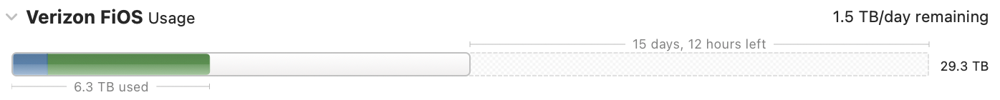
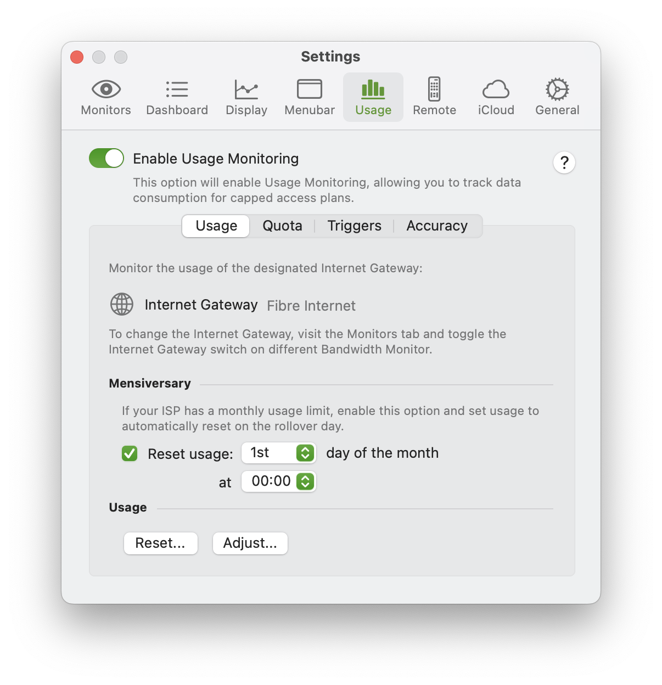
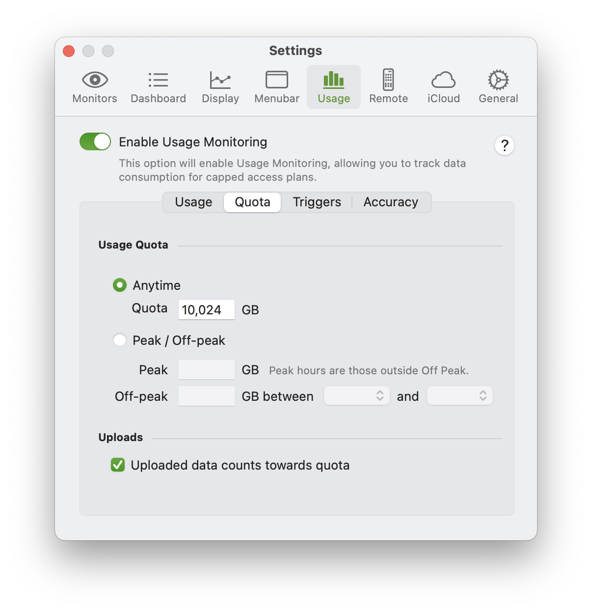
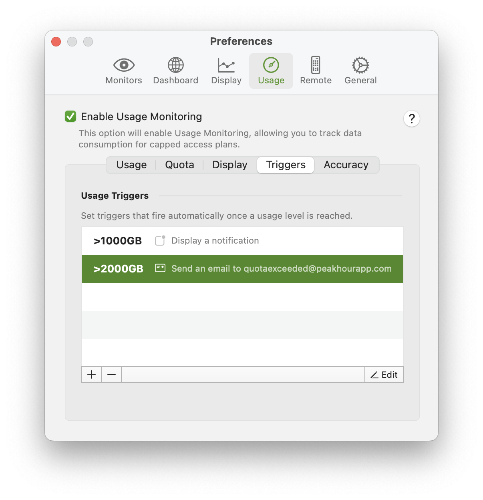

import NeedsReview from '@/components/NeedsReview.astro';
import img1 from './usage-images/cleanshot-2023-12-16-at-12-07-49-2x-20231216-170757-2.png';

<NeedsReview />

[Configuring Usage Monitoring](#Usage-ConfiguringUsageMonitoring) | [Usage](#Usage-Usage) | [Quota](#Usage-Quota) | [Triggers](#Usage-Triggers) | [Thresholds](#Usage-Thresholds) | [Accuracy](#Usage-Accuracy)

Usage Monitoring provides a real-time view of your Internet usage. You can set a monthly quota and reset date and PeakHour will then track your usage, showing how much you have remaining.

# Configuring Usage Monitoring

To set up Usage Monitoring:

1.  Check the **Enable Usage Monitoring** checkbox at the top of the Usage tab.

2.  Usage Monitoring will track usage of the Monitor designated as your Internet Gateway. The change which Monitor is your Internet Gateway, check the Internet Gateway switch on the Monitors tab.
    
    

3.  Choose whether a **Mensiverary** (or monthly rollover) date applies**.** This is the day of the month that your usage resets. If you're unsure, check with your ISP.  
    If you choose not to enable this, Usage operates in "Pre-paid" mode where usage will continue to accumulate until it is manually reset. This is useful if you buy your Internet in pre-paid chunks. 

4.  On the **Quota** tab, choose between **Anytime** or **Peak/Off Peak**. Set the amounts of data included in your quota and (if** Peak/Off Peak** is chosen) the time of day when Off Peak applies.

5.  Choose whether **Uploaded data counts towards quota**.

## Usage

<table>
<tbody>
<tr class="odd">
<td><strong>Internet Gateway</strong></td>
<td>
This shows the currently selected Internet Gateway. To change this, use the <strong>Internet Gateway</strong> switch on the Monitors tab.

</td>
</tr>
<tr class="even">
<td><strong>Reset usage</strong></td>
<td>
This checkbox controls whether usage is automatically reset.

<ul>
<li>
If enabled, Usage will automatically reset on the chosen day &amp; hour of the month or each day on the chosen hour if set to 'Every'.
</li>
<li>
If disabled, Usage will only reset if you manually click the <strong>Reset...</strong> button or right-click on the Usage area of the main window and choose <strong>Reset...</strong>
</li>
</ul></td>
</tr>
<tr class="odd">
<td><strong>Reset...</strong></td>
<td>Resets usage to zero.</td>
</tr>
<tr class="even">
<td><strong>Adjust...</strong></td>
<td>Opens a panel allowing you to manually adjust the current amount of usage. Use this if you're part way through your usage period and need to bring PeakHour 'into sync' with actual usage.</td>
</tr>
</tbody>
</table>

## Quota

The Quota tab is where you configure how much internet usage you are allowed.

<table>
<tbody>
<tr class="odd">
<td><strong>Anytime</strong></td>
<td>
Anytime quota lets you specify your maximum quota for the period.

<strong>Note:</strong> You can set a quota of '0' if you have no limit, but still want to track usage.
</td>
</tr>
<tr class="even">
<td><strong>Peak / Off-peak</strong></td>
<td>
If your ISP offers a different quota during Off Peak hours vs. Peak hours, choose this option.

Note: specify a quota of '0' in either if you have no limit for that period but still want to track usage.
</td>
</tr>
<tr class="odd">
<td><strong>Between...</strong></td>
<td>The time period for which Off-peak quota applies. Usage between these two times is considered <strong>Off Peak</strong> usage and usage outside these two times is considered <strong>Peak</strong> usage.</td>
</tr>
<tr class="even">
<td><strong>Uploaded data counts towards quota</strong></td>
<td>Some ISPs do not count uploads towards your quota usage. Turn this on to count uploaded data; turn it off to ignore it.</td>
</tr>
</tbody>
</table>

## Triggers

Usage triggers allow you to set thresholds at which PeakHour will trigger an event.

PeakHour can perform these things in response to a trigger threshold being met:

  - Display a notification

  - Send an email

For example, you may want to receive a notification when you've exceeded 50% and 75% of your monthly quota. You may then also want to receive a notification and an email at 100% of your monthly quota.

You can create as many triggers as you like.

### Thresholds

Usage thresholds can either be:

  - A specific amount of usage in Megabytes

  - A specific amount of usage in Gigabytes

  - A percentage of your total usage.

When a Peak/Off-Peak quota usage is specified, you can specify different triggers for both.

## Accuracy

The accuracy tab displays some information about the currently chosen Target and allows you to disable the warning about usage inaccuracy.

For detailed information about Usage Monitoring and accuracy, see the [Usage Monitoring](https://peakhoursupport.atlassian.net/wiki/spaces/wiki/pages/655483/Usage+Monitoring) Wiki page.

